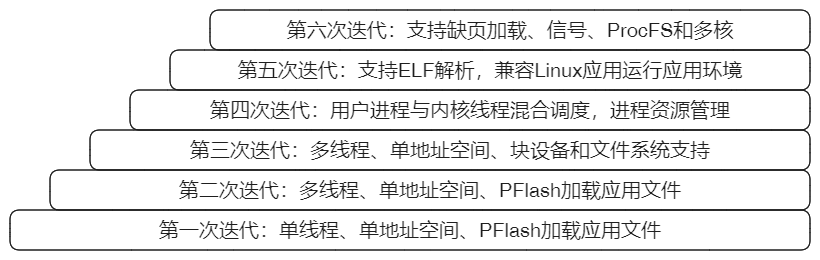
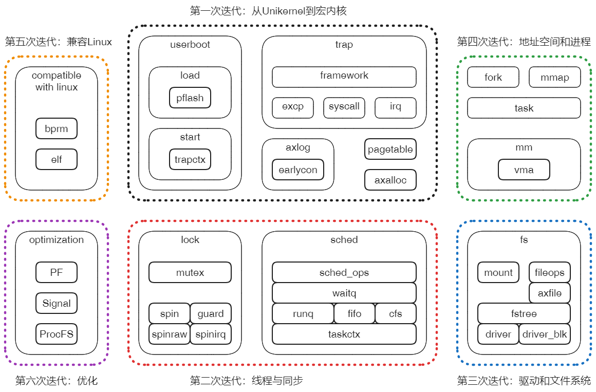
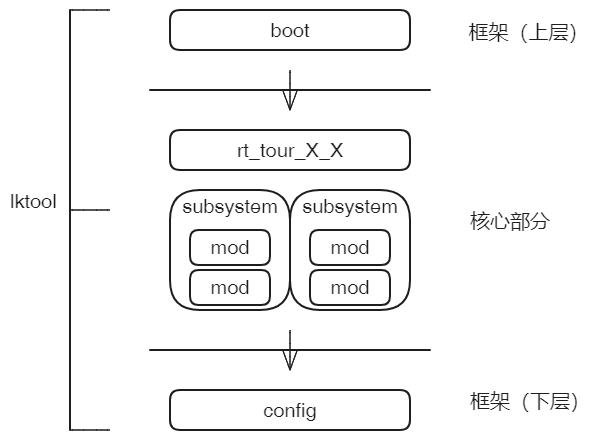
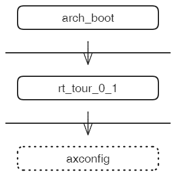
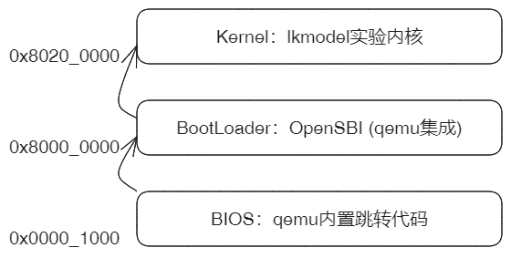
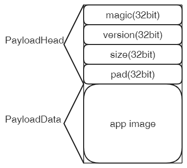
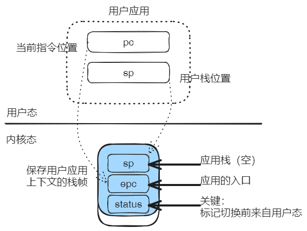
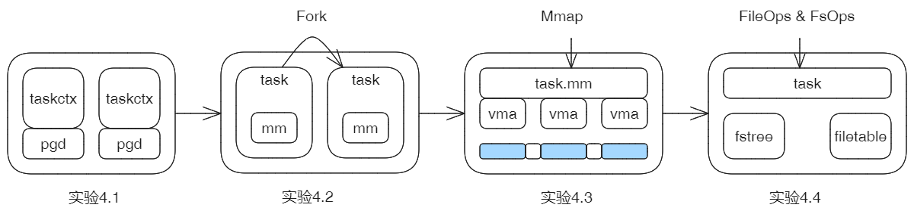
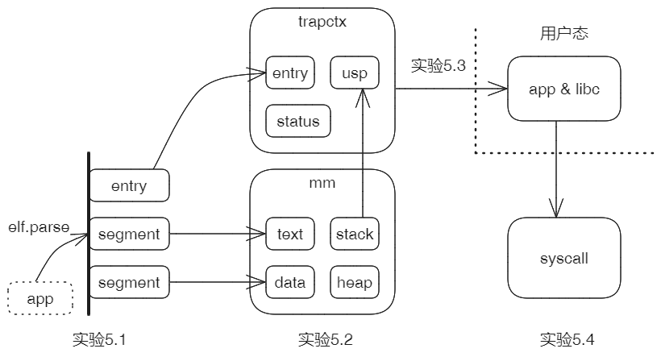
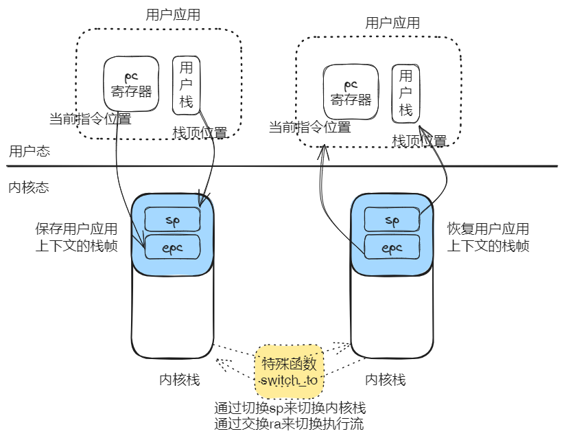

通过本实验指导，我们将一起探索基于组件化来构建宏内核的方法。在第零章中，先给出一个实验框架，这包括一个基础的组件仓库，一个管理组件和构建内核的工具，以及配套的系统构建方法。后面的各章，以迭代方式组织实验，从最简单的宏内核雏形开始，逐步扩展完善功能特性，最终形成一个典型的宏内核系统。每一章对应一轮迭代，每次迭代包含若干步骤，每个步骤对应一个实验，多数实验都是在之前实验的基础上进行扩展，但每个实验都可以独立运行。建议按照章节顺序，阅读相关原理和进行实验，并完成扩展练习。

## 第零章 - 实验准备

本章介绍实验的背景概况和实验前需要进行的准备工作，并给出 实验0.1 - 系统引导 作为示例。

### 第一节 宏内核系统构成

宏内核是在内核态集成了大部分操作系统核心功能的内核形态。

宏内核系统对外提供两方面交互服务：

1. 在启动阶段，从存储介质取出默认的应用程序文件，作为首个用户态应用启动
2. 在运行过程中，响应外部的中断、异常和系统调用（syscall通常是异常的一类）

宏内核系统对应rt_macrokernel组件，由它组织和协同userboot和trap两个子系统，分别支持上述两个对外服务。


userboot和trap两个子系统由更小一级规模的子系统构成，直至最基本的组件。每级子系统封装本身和下级功能，通过简洁明确的接口为上级系统提供服务。后面的实验中，会体现这一层次化的设计模式。

### 第二节 组件仓库和组件分类

组件仓库包含了目前已经提取的具有可复用价值的独立组件。

实验就是在选择和组合组件的基础上，层次化的构建目标系统，目标系统包括从基本的功能子系统到完整的宏内核系统。

组件按照其功能和所处的层次，可以分为如下几个类别：


1. 框架组件：所有目标实验系统都必须依赖的组件，包括boot和config。boot负责内核的早期引导，建立基本的运行环境，然后把执行权交由实验系统继续执行；config组件为系统提供可配置的编译选项和运行时参数。
2. 接口组件（Interface）：直接与外部的应用或硬件设备进行交互的组件，它们主要承担的是外部请求转发，通过不负责具体的功能实现。
3. 逻辑操作组件（Logic）：逻辑操作集合。
4. 数据模型组件（Model）：对象的建模表示和维护运行实例。
5. HAL组件：屏蔽体系结构和硬件复杂性，提供体系结构无关层接口。
6. 辅助组件（Utility）：辅助系统开发、调试和运行的非必要组件。包括logging、tracing等。

### 第三节 总体实验安排

实验包括六次迭代，分别对应第一章到第六章。每一次迭代都建立在上次迭代的基础上，并且每次迭代成果都是一个宏内核系统：从最简单的雏形到兼容Linux的典型宏内核。



下图，标记了每次迭代的系统构成和相对**增量**。



### 第四节 实验框架和环境

每一步实验都是构建一个特定功能的组件化子系统，并对它进行必要的功能和性能验证。

为简化实验操作，在组件仓库的基础上提供lktool工具和构建系统方法，建立如下的实验框架。



工具lktool负责管理组件仓库，并封装了配置、准备资源、编译和运行等构建步骤，简化实验过程。

目标实验系统分为三层：

1. 上层框架：boot组件引导系统并建立运行环境。
2. 核心部分：实现当前实验的核心功能，达成本步骤的目标。其中rt_tour_X_X作为核心组件，组织必要的子系统协同完成核心功能。
3. 下层框架：config组件为系统提供可配置的编译选项和运行参数。

这主要通过框架和工具配合完成。

> 核心组件rt_tour_X_X代表当前实验，其中X_X是实验的编号，分别为迭代序号和步骤序号。
>
> 当切换实验时，以该组件名称为标志性参数。
>
> 如本章唯一的实验0.1，它的核心组件就是rt_tour_0_1。
>
> 通过执行`lk chroot rt_tour_0_1`把实验0.1设置为当前实验。


#### 建立实验环境

目前本指导书的所有实验基于Ubuntu22.04 LTS - X86_64的系统环境。可以基于物理机或WSL2。

> 如果选用其它Linux发行版或Ubuntu的其它版本，实验过程中可能会发生意外情况。建议遵循上述环境要求。


1. 基础开发工具和库

   ```sh
   sudo apt install autoconf automake autotools-dev curl libmpc-dev libmpfr-dev \
       libgmp-dev gawk build-essential bison flex texinfo gperf libtool \
       patchutils bc zlib1g-dev libexpat-dev pkg-config  libglib2.0-dev \
       libpixman-1-dev libsdl2-dev git tmux python3 python3-pip ninja-build
   ```

2. Rust 开发环境

   ```sh
   curl https://sh.rustup.rs -sSf | sh
   cargo install cargo-binutils
   ```

3. Qemu 模拟器（RiscV64）

   ```sh
   sudo apt install qemu-system-riscv64
   ```

4. RiscV 工具集

   ```sh
   sudo apt install binutils-riscv64-unknown-elf
   ```


#### 实验工程和lktool工具

1. 下载项目工程和切换分支

   ```sh
   git clone git@github.com:shilei-massclouds/lkmodel.git
   git checkout tour
   ```

2. 编译lktool工具

   ```sh
   cd tools/lktool
   cargo build
   cd ../..
   ```

3. 把lktool加入到环境变量，并采取短名称lk

   ```sh
   export PATH=$PATH:/home/cloud/gitWork/lkmodel/tools/lktool/target/debug
   alias lk='lktool'
   ```

   > 注意：需要把/home/cloud/gitWork/lktool替换为实际路径


#### 实验基本操作步骤

实验只针对Riscv64体系结构，目前实验工程lkmodel的默认配置就是该体系结构，如果不是，请执行如下命令重置：

```sh
lk config riscv64
```


对指导书宏的所有实验，都遵循如下操作步骤：

```sh
lk chroot rt_tour_X_X
lk prepare
lk run
```

第1行：每一次实验都是在构建一个可以独立运行的内核系统。如前述，核心组件rt_tour_X_X代表它对应的特定实验，命名中的X_X就是实验编号。如rt_tour_0_1对应本章实验0.1。

第2行：部分实验需要一些前置条件，比如可能需要构建一个磁盘系统或提供具体的文件系统作为数据源。这些通过prepare自动建立，所以建议每个实验中都默认执行这一步。不需要额外准备的，该步骤是空操作。

第3行：正式运行实验，并观察结果。


### 第五节 实验0.1 - 系统引导

这是本指导书的第一个实验，实现单纯的内核系统启动，建立一个基本的运行环境。

目标实验系统的构成如下：



所以仅需要关注两个组件， arch_boot和rt_tour_0_1。

arch_boot是重点，掌握引导原理和具体过程是本节实验的目标。（lkmodel/arch_boot/arch_boot）

rt_tour_0_1只是在引导完成后启动的一个“空壳”，用于验证系统引导成功并退出。(lkmodel/tour_stage/rt_tour_0_1)

下面就来关注一下计算机系统中，内核引导的原理和基本过程。

> 后面所有的实验章节都参照本节的形式，先说明实验目标，然后介绍原理性知识，最后进行实验操作。
>
> 但在实际学习过程中，也可以先做实验，再回头看前面的原理性内容。


从计算机启动到内核启动通常要经历下面两个阶段：



模拟器qemu-riscv64启动时，将会经历几个阶段：

1. 程序寄存器**PC**首先被初始化为0x1000的地址；

2. 地址0x1000处被qemu预先放置了一个ROM，顺序执行其中包含的寥寥几行代码，**PC**跳转到0x8000_0000地址；

3. 地址0x8000_0000同样被qemu预先埋伏了OpenSBI(后文简称SBI)，并且入口就在这个开始地址。SBI由此处启动，进行一系列的硬件初始化工作，并提供一组基本的功能调用，为后面操作系统内核的启动准备好条件和环境；最后一步，SBI从M-Mode切换到S-Mode，并跳转到地址0x8020_0000继续执行。
4. 地址0x8020_0000就是为内核准备的位置，只要我们把内核加载到此处，并且保证内核入口在开头，就能够获得计算机的控制权。

> Riscv体系结构及平台在很多方面都体现了设计上的简洁。RISC-V SBI规范定义了平台固件应当具备的功能和服务接口，多数情况下SBI本身就可以代替传统上固件BIOS/UEFI + BootLoader的位置和作用，qemu-riscv64模拟器同样参照模拟了这一情况，并且把OpenSBI集成到qemu工程内部。而对于X86等体系结构，qemu仍是延用传统方式，即从内嵌seabios开始引导，经过grub等BootLoader的进一步准备，最后再启动操作系统内核。

总结一下，我们的目标是，让自己开发的内核等候在正确的位置上，并以正确的形式存在。具体来说满足以下要求：

1. 内核被加载到0x8020_0000地址

   这是qemu的职责，我们只需要指定正确的参数。

2. 内核编译后的形式必须是binary

   Rust编译器输出的默认执行程序格式是ELF，这种格式需要被ELF加载器解析和加载。

   显然，内核的上一级加载器SBI并不支持ELF功能，所以只能让编译出来的内核以原始binary形式提供。

   > 至少目前OpenSBI还没有支持ELF的计划。但是确实存在一些其它的BootLoader支持这样的功能。

3. 内核入口必须在Image文件的开头

   Rust编译器默认情况下，会自己安排可执行程序文件的分段与符号布局。由于我们必须确保内核入口在最前面，所以需要通过自定义LDS文件方式，控制内核image文件的布局。

   arch_boot组件包含LDS模板文件linker.lds，在编译时该组件的build.rs会根据当前的体系结构，生成最终的目标文件。
   
   在本实验中就是lkmodel/arch_boot/arch_boot/linker_riscv64-qemu-virt.lds
   
   ```shell
   OUTPUT_ARCH(riscv)
   
   BASE_ADDRESS = 0xffffffc080200000;
   
   ENTRY(_start)
   SECTIONS
   {
       . = BASE_ADDRESS;
       _skernel = .;
   
       .text : ALIGN(4K) {
           _stext = .;
           *(.text.boot)
           *(.text .text.*)
           . = ALIGN(4K);
           _etext = .;
       }
       
       ...
   }
   ```

   有两个地方需要注意：

   首先是把代码区.text作为第一个section，并且其中\*(.text.boot)在\*(.text .text.\*)之前，后者是代码默认情况下所属的section属性。将来我们把内核入口的代码标记在.text.boot区域中，就可以确保它会被最早执行。

   此外，起始地址BASE_ADDRESS是一个虚拟地址0xffffffc080200000，它与期望的加载内核的物理地址0x8020_0000之间正好相差一个偏移0xffff_ffc0_0000_0000，这个偏移的名字是**PHYS_VIRT_OFFSET**，将来它会在虚实地址转换中发挥重要作用。目前该地址不起作用，暂时忽略它。主要的原因是，最初的引导代码寻找方式是相对PC寻址，即引导代码是位置无关的。
   
   LDS中还有一些其它的关键信息，在后边章节再详细介绍。


在内核获得控制权后，进行如下步骤的引导和初始化：

1. 保存一些必要的信息
2. 建立栈以支持函数调用
3. 启用分页，支持虚拟地址空间
4. 设置中断/异常向量表
5. 清零BSS区域
6. 调用固定名称的外部函数入口runtime_main

前面4步是汇编代码，第5步开始进入到Rust函数中执行。

第6步是arch_boot与rt_tour_0_1两个组件之间的交界点，标志着引导阶段结束，开始核心代码部分的执行。

```rust
//arch_boot/arch_boot/src/platform/riscv64_qemu_virt/mod.rs

unsafe extern "C" fn rust_entry(cpu_id: usize, dtb: usize) {
    super::clear_bss();
    // Todo: remove it in future.
    // We need to enable sum only when necessary.
    riscv::register::sstatus::set_sum();

    runtime_main(cpu_id, dtb);
}

extern "Rust" {
    fn runtime_main(cpu_id: usize, dtb: usize);
}
```

包括rt_tour_0_1在内所有的rt_xxx组件都会实现这个runtime_main函数，从而可以接过arch_boot对系统的执行权。

本实验中，rt_tour_0_1只是用于确认引导过程成功，因而实现非常简单 - 直接停机。

```rust
// tour_stage/rt_tour_0_1/src/main.rs
#[no_mangle]
pub extern "Rust" fn runtime_main(_cpu_id: usize, _dtb_pa: usize) {
    axhal::misc::terminate();
}
```

下面就来实际操作一下实验过程，如上一章所述的标准步骤：

```sh
lk chroot rt_tour_0_1
lk prepare
lk run
```

显示结果：

```sh
... ...
Boot HART MHPM Count      : 0
Boot HART MIDELEG         : 0x0000000000000222
Boot HART MEDELEG         : 0x000000000000b109
cloud@server:~/gitWork/lkmodel$
```

在打印一些OpenSBI的常规输出后，系统退出。

确认执行正常的方式是查看当前目录下生成的qemu.log，定位到地址0x0000000080200000，即内核入口处，内容如下：

```assembly
----------------
IN:
Priv: 1; Virt: 0
0x0000000080200000:  842a              mv              s0,a0
0x0000000080200002:  84ae              mv              s1,a1
0x0000000080200004:  00002117          auipc           sp,8192         # 0x80202004
0x0000000080200008:  ffc10113          addi            sp,sp,-4
0x000000008020000c:  000402b7          lui             t0,262144
0x0000000080200010:  9116              add             sp,sp,t0
0x0000000080200012:  00000097          auipc           ra,0            # 0x80200012
0x0000000080200016:  02a080e7          jalr            ra,ra,42

----------------
IN:
Priv: 1; Virt: 0
0x000000008020003c:  00001517          auipc           a0,4096         # 0x8020103c
0x0000000080200040:  fc450513          addi            a0,a0,-60
0x0000000080200044:  200005b7          lui             a1,536870912
0x0000000080200048:  0ef5859b          addiw           a1,a1,239
0x000000008020004c:  e90c              sd              a1,16(a0)
0x000000008020004e:  7ff50513          addi            a0,a0,2047
0x0000000080200052:  00b538a3          sd              a1,17(a0)
0x0000000080200056:  8082              ret
```

从日志中0x80200000的那行开始，与arch_boot的启动代码进行对照，可以确认内核完成了引导过程。

通过这个对照过程，可以帮助我们从体系结构层面加深对启动过程的理解。


### 本章总结

本章首先介绍了实验背景和概况，然后说明了如何建立实验环境以及实验操作的步骤，最后给出了第一个实验0.1。

目前实验0.1构建的内核系统还干不了任何有意义的事，它仅是一个“空”的框架。

下一章，我们将实验基于层次化方式逐步构建出一个原始的宏内核。


## 第一章 - 从Unikernel到宏内核

本章目标：建立最原始的宏内核系统。内核以单线程模式，从pflash加载应用并切换到**用户态**执行。用户态应用运行期间，依次触发异常和系统调用，而内核能够正常响应和处理。为完成上述功能，内核首先需要支持日志输出、动态内存分配和页表映射功能。

当前阶段宏内核的大部分功能与Unikernel无异，只是在特权级切换与系统调用方面扩展了少量功能。本章进行的一系列实验，可以看作是从最简单的Unikernel向宏内核演变的过程。

### 第一节 本章系统构成


### 第二节 本章实验安排

实验1.1：支持输出信息到屏幕，让内核具备最基础的调试能力。

实验1.2：增加动态内存分配机制，为Rust的alloc库提供内存分配支持，并为内核提供按页分配服务。

实验1.3：重建系统的地址空间，内核支持动态页表映射。

实验1.4：增加PFlash组件，支持从设备直接加载外部应用到指定内存区域。

实验1.5：通过构建异常上下文，让应用返回到用户态运行。

实验1.6：内核支持ebreak异常和自定义系统调用处理，并能够响应时钟中断。


### 第三节 实验1.1 - 控制台输出和系统日志

上一章进行了第一个实验，但我们看不到内核的输出信息，只能通过查看qemu跟踪日志确认工作结果。现在是实现打印输出的时候了！

#### 控制台输出

有两个办法可以让内核支持console，一是通过管理Uart串口设备进行输出，二是直接调用OpenSBI提供的功能。前一个方式需要自己实现驱动，但目前我们连最基础的内存管理都未能完成，缺乏实现驱动的条件；所以决定采用第二个办法。基于SBI的控制台仅用于内核系统的早期启动阶段，命名为early_console；等条件具备后，再实现正式的console设备并切换。

OpenSBI提供了一系列功能调用，可以通过调用号去请求SBI为我们完成部分工作。查阅OpenSBI文档，发现功能调用**console_putchar**具有打印输出一个字符的能力，正可以作为输出功能的基础。然后从crates.io中，我们找到了sbi-rt这个现成的库，它封装了对sbi功能调用的各种方法。现在就使用它来实现early_console组件。

```rust
pub fn putchar(c: u8) {
    #[allow(deprecated)]
    sbi_rt::legacy::console_putchar(c as usize);
}

pub fn write_bytes(bytes: &[u8]) {
    for c in bytes {
        putchar(*c);
    }
}
```

系统中直接调用early_console::write_bytes，就可以完成屏幕信息的输出。

```rust
// tour_stage/rt_tour_1_1/src/main.rs

#[no_mangle]
pub extern "Rust" fn runtime_main(_cpu_id: usize, _dtb_pa: usize) {
    let msg = "\n[rt_tour_1_1]: earlycon!\n\n";
    early_console::write_bytes(msg.as_bytes());
	... ...
}
```

#### 系统日志

基于early_console打印信息的方式比较原始，难以满足我们在内核开发中的需要，我们还需要以它为基础，来为内核提供正式的日志功能。在crates.io中有一个用的logging框架，通过实现少量接口就可以获得一个功能完备的日志机制。

```rust
// axlog2/axlog2/src/lib.rs
impl Log for Logger {
    #[inline]
    fn enabled(&self, _metadata: &Metadata) -> bool {
        true
    }

    fn log(&self, record: &Record) {
		... ...
        let now = call_interface!(LogIf::get_time);

        print_fmt(with_color!(
            ColorCode::White,
            "[{:>3}.{:06} {path}:{line}] {args}\n",
            now.as_secs(),
            now.subsec_micros(),
            path = path,
            line = line,
            args = with_color!(args_color, "{}", record.args()),
        ));
    }

    fn flush(&self) {}
}
```

重点是实现Logger::log，内部通过print_fmt实现日志输出，中间经过了Logger对象的处理，它实现了core::fmt::Write这个Trait。中间层为日志赋予了对变参的处理能力。如下：

```rust
impl Write for Logger {
    fn write_str(&mut self, s: &str) -> fmt::Result {
        early_console::write_bytes(s.as_bytes());
        Ok(())
    }
}

pub fn print_fmt(args: fmt::Arguments) {
    Logger.write_fmt(args)
}
```

第3行：最终仍然是通过early_console::write_bytes输出信息到屏幕，但是现在可以调用更高级的日志接口来输出跟踪调试信息。

```rust
#[no_mangle]
pub extern "Rust" fn runtime_main(_cpu_id: usize, _dtb_pa: usize) {
	... ...
    axlog2::init("debug");
    info!("[rt_tour_1_1]: ...");
    info!("[rt_tour_1_1]: ok!");
    axhal::misc::terminate();
}
```


具体的实验操作：

```sh
lk chroot rt_tour_1_1
lk prepare
lk run
```

屏幕打印如下信息：

```sh

[rt_tour_1_1]: earlycon!

Logging is enabled.

[  0.033721 rt_tour_1_1:15] [rt_tour_1_1]: ...
[  0.035934 rt_tour_1_1:16] [rt_tour_1_1]: ok!
[  0.036447 axhal::platform::riscv64_qemu_virt::misc:3] Shutting down...
```

第2行是直接通过early_console输出的信息。

第4行是启用logging之后的输出信息，可以尝试通过修改日志等级来控制输出信息的详细程度。

当前系统已经具备了基于级别打印日志的功能，但是只能输出有限类型的信息。对于String、Vec等复合类型还不能支持，主要原因是当前内核缺乏动态内存分配的功能。下一节就来实现这部分。


### 第四节 实验1.2 - 动态内存分配

在Rust开发中，String、Vector之类的各种复合类型为我们带来了很大便利。但是我们的内核目前还不支持，因为没有实现动态内存分配器。我们可以来尝试一下，把实验rt_tour_1_1的runtime_main函数改成这样：

```rust
#[no_mangle]
pub extern "Rust" fn runtime_main(_cpu_id: usize, _dtb_pa: usize) {
    axlog2::init("debug");
    let s = String::from("from String");
    info!("[rt_tour_1_1]: ... [{}]", s);
    info!("[rt_tour_1_1]: ok!");
    axhal::misc::terminate();
}
```

按照上节的步骤编译或运行时，会报如下的错误：

```sh
error: no global memory allocator found but one is required; link to std or add `#[global_allocator]` to a static item that implements the GlobalAlloc trait
```

String需要动态内存即堆管理的支持，在Rust开发中有这种需求的还包括Box、Arc等智能指针等其它类型和机制。

普通Rust应用经由std标准库去申请底层操作系统内核对内存分配的支持，但是我们本身就是在实现内核，没有std标准库，所以只能自己实现内核级的内存分配器。本节的目标是，为内核实现支持动态内存分配的分配器。

内核级内存分配器需要满足两个方面的要求：

* 分配器必须实现GlobalAlloc trait，如String、Vector等集合数据类型都需要基于这个trait定义接口对分配器发出要求，请求以字节为最小分配单位。
* 内核的很多功能都要求申请以**页**为基本单位，并且开始地址按页对齐的分配块。这种按页分配在内核开发中是十分常用和必要的，有必要作为独立的服务接口对外提供。

总结一下，功能上我们需要两种相互独立的内存分配器，一种基于字节分配，另一种基于页分配。

实现过程分三个步骤：

1. 向Rust声明一个支持GlobalAlloc Trait的内存分配器GlobalAllocator，这个Trait是向Rust提供动态内存分配服务的标准接口。GlobalAllocator内部包含两个子分配器：**页**内存分配器和**字节**内存分配器。
2. 初始化**页**内存分配器，为它指定可以使用的全部内存地址范围，此时的内核可以支持按页分配内存。页分配的默认算法是bitmap。
3. 初始化**字节**内存分配器，该分配器可用的内存来自**页**内存分配器，在初始化或内存不足时，向**页**内存分配器申请。完成该步骤后，内核就可以支持各种基于alloc库的类型和机制。字节分配的默认算法是tlsf。


下面来验证动态内存分配的能力：

```rust
#[no_mangle]
pub extern "Rust" fn runtime_main(_cpu_id: usize, _dtb_pa: usize) {
    axlog2::init("debug");
    info!("[rt_tour_1_2]: ...");

    axalloc::init();

    let s = String::from("Hello, axalloc!");
    info!("Alloc string: {}", s);

    let va = global_allocator().alloc_pages(1, PAGE_SIZE_4K).unwrap();
    info!("Alloc page: {:#x}", va);

    let dwords = unsafe {
        slice::from_raw_parts_mut(va as *mut u64, PAGE_SIZE_4K/8)
    };
    for dw in dwords.iter_mut() {
        *dw = 0xAABBCCDD;
    }
    for dw in dwords {
        assert_eq!(*dw, 0xAABBCCDD);
    }
    global_allocator().dealloc_pages(va, 1);
    info!("Dealloc page: {:#x}", va);

    info!("[rt_tour_1_2]: ok!");
    axhal::misc::terminate();
}
```

第6行：初始化动态内存分配器。

第8~9行：验证String复合类型可用，说明了内核对字节分配的支持。

第11~24行：验证按页进行内存分配的能力。中间的读写测试确认了对获得内存页的具有访问权。


实际操作步骤：

```sh
lk chroot rt_tour_1_2
lk prepare
lk run
```

看到输出信息：

```sh
[  0.050159 axalloc:250]   use TLSF allocator.
[  0.051347 axalloc:213] initialize global allocator at: [0xffffffc08026b000, 0xffffffc088000000)
[  0.054835 rt_tour_1_2:22] Alloc string: Hello, axalloc!
[  0.055856 rt_tour_1_2:25] Alloc page: 0xffffffc080273000
[  0.056664 rt_tour_1_2:37] Dealloc page: 0xffffffc080273000
[  0.057241 rt_tour_1_2:39] [rt_tour_1_2]: ok!
[  0.057749 axhal::platform::riscv64_qemu_virt::misc:3] Shutting down...
```

本节解决了动态内存分配的问题，为后面内核的开发过程建立了重要基础，下一节来处理内存管理的另一个重要方面 - 分页。


### 第五节 实验1.3 - 分页管理

在上一章的第五节 - 实验0.1中，我们已经看到过启用分页的那一步，即内核在刚启动时，就已经启用分页进入到了虚拟地址空间。但是当时只是固定映射了内核本身所在的1G空间。本节我们将支持完整的分页管理功能，完成两个任务：

1. 重新建立地址空间映射：重点是把设备对应的MMIO区域映射进来，为后面支持PFlash和块设备驱动做准备。
2. 支持对页表的动态映射：无论是宏内核本身还是应用，都有动态映射/解除映射的需求


在进行实验任务之前，先来了解一下分页相关的原理知识。

分页的基本数据结构包括：页表和页表项。页表可以多级嵌套，顶级为根页表。

从根页表开始，每一级页表都占用一个内存页，关于内存页大小，我们采用最典型的4096字节。Sv39是针对64位系统的分页方案，即页表项长度是8字节，所以每个页表包含512个页表项。页表作为多级嵌套结构，由页表page_table和页表项page_table_entry两种基本元素交替构成，它们符合如下的模式：


每个页表page_table对应一个内存页，每个页划分为512个页表项page_table_entry；页表项page_table_entry由物理页帧号pfn和标志位组flags这两部分构成。根据标志位不同，页表项有三种情况：

* 空页表项：尚未与物理页建立映射；
* 指向下级页表：pfn保存的是下级页表的物理页帧号，当进行地址映射时，需要递归到下一级页表继续处理；
* 指向最终页：这种是叶子页表项(leaf entry)，它的pfn直接就保存着一个物理页或者**大页**的页帧号。

下面来看一下flags各个位的具体功能定义，这里部分参照了Linux对各个位的命名：

```rust
/*
 * RiscV64 PTE format:
 * | XLEN-1  10 | 9             8 | 7 | 6 | 5 | 4 | 3 | 2 | 1 | 0
 *       PFN      reserved for SW   D   A   G   U   X   W   R   V
 */
const _PAGE_V : usize = 1 << 0;     /* Valid */
const _PAGE_R : usize = 1 << 1;     /* Readable */
const _PAGE_W : usize = 1 << 2;     /* Writable */
const _PAGE_E : usize = 1 << 3;     /* Executable */
const _PAGE_U : usize = 1 << 4;     /* User */
const _PAGE_G : usize = 1 << 5;     /* Global */
const _PAGE_A : usize = 1 << 6;     /* Accessed (set by hardware) */
const _PAGE_D : usize = 1 << 7;     /* Dirty (set by hardware)*/

const PAGE_TABLE: usize = _PAGE_V;
pub const PAGE_KERNEL_RO: usize = _PAGE_V | _PAGE_R | _PAGE_G | _PAGE_A | _PAGE_D;
pub const PAGE_KERNEL_RW: usize = PAGE_KERNEL_RO | _PAGE_W;
pub const PAGE_KERNEL_RX: usize = PAGE_KERNEL_RO | _PAGE_E;
pub const PAGE_KERNEL_RWX: usize = PAGE_KERNEL_RW | _PAGE_E;
```

flags从第10位往上是物理页帧号pfn，而低10位是页表项的属性标志位。

第0位V：页表项是否有效，当访问无效页面时，MMU触发Page Fault之类的异常，这通常作为Linux等内核缺页加载的基本机制；

第1~3位RWE：对映射后的页面是否分别具备读、写、执行权限，当越权访问时，MMU触发Access Fault之类的异常，在Linux等内核实现中，可以基于该类异常实现COW写时拷贝；

第4位U：表示这是用户页。由于实验内核是Unikernel形态，不存在用户态，所以这个位直接清零。

第5位G：表示是全局页。这个位与tlb刷新有关。我们的Unikernel内核中，所有用到的页面都设置为全局页。

第6~7位AD：分别表示Accessed访问过和Dirty被改写过。对于Linux等内核，通常是先把它们清零，如果运行过程中访问或改写了对应映射的页面，MMU硬件会自动把它们置一，内核只要检查这两个位，就能知道是否发生过访问或改写的情况，这通常对页面置换策略有帮助。但是对我们的内核，没有涉及页面置换的问题，所以初始化时，只是简单的把它们都设置成一。

基于上述位，对外提供两个公开的复合标识。PAGE_KERNEL_RW作为默认的地址映射标识，表示映射的页面存在并可以读写；PAGE_KERNEL_RWX在此基础上增加执行权限。


#### 重建内核的地址空间

内核启动时，初次启用分页映射的地址空间从0x8000_0000开始，映射开放了所有权限，可以任意读写和执行，总共为1G。

这1G空间对应于下图黄色、蓝色的全部和灰色的一部分，不包含绿色部分。


重建后的地址空间映射有几个主要的变化。

1. SBI被从映射中去除了。SBI相当于上一级的bootloader，我们的内核必须通过SBI提供的sbi_ecall来调用它的功能，不应该看到SBI在地址空间中的映射区间。

2. 内核本身的各个段，按照段的特点属性，进行精细化的映射。例如代码段.text的权限是只读和执行，而数据段.data就是读写。

3. 内核自身空间之上的所有空闲区间，作为内核的堆空间，堆空间的上限是物理内存最高地址。
4. 建立对设备地址区间的映射，主要是virtio-mmio各地址区间，为后面内核进行设备的发现与管理做准备。


#### 动态映射和解除映射

建立动态映射实际包括两步：

1. 通过动态内存管理的页分配服务申请内存页，获得其开始的物理地址。
2. 递归页表找到目标页表项并填充，完成虚拟地址和物理地址的映射。

把上述步骤封装到一个接口函数中，对应原型是：

```rust
fn map_region_and_fill(&mut self, va: VirtAddr, size: usize, flags: MappingFlags) -> PagingResult;
```

只需要指出要映射的虚拟地址区间范围和权限，其它操作的步骤和细节在内部处理。

相应的解除映射，就是反向执行上述步骤，即清除目标页表项和释放对应的物理页。原型是：

```rust
fn unmap_region(&mut self, va: VirtAddr, size: usize) -> PagingResult<PhysAddr>;
```

只需要指出要解除的虚拟地址区间范围。


看一下具体的实验(节选代码，完整代码路径tour_stage/rt_tour_1_3/src/main.rs)，主要注意三点：

```rust
#[no_mangle]
pub extern "Rust" fn runtime_main(cpu_id: usize, dtb_pa: usize) {
	... ...
    // Alloc new pgd and setup.
    let mut pgd = pgd_alloc();
    unsafe {
        write_page_table_root0(pgd.root_paddr().into());
    }
    
    // Makesure that we can access pflash region.
    let va = phys_to_virt(PFLASH_START.into()).as_usize();
    let ptr = va as *const u32;
    unsafe {
        info!("Try to access dev region [{:#X}], got {:#X}", va, *ptr);
        let magic = mem::transmute::<u32, [u8; 4]>(*ptr);
        info!("Got pflash magic: {}", str::from_utf8(&magic).unwrap());
    }

    // Makesure that we can map a user-page and read/write/execute.
    let flags = MappingFlags::READ | MappingFlags::WRITE | MappingFlags::EXECUTE | MappingFlags::USER;
    pgd.map_region_and_fill(USER_APP_ENTRY.into(), PAGE_SIZE_4K, flags).unwrap();
	... ...
    pgd.unmap_region_and_free(USER_APP_ENTRY.into(), PAGE_SIZE_4K).unwrap();
	... ...
}
```

第5~8行：初始的内核页表一旦完成初始化，就不允许再修改。所以动态申请了一个新的页表，第7行启用它作为当前页表。

第11~17行：确认设备MMIO的地址空间已经被映射，并且可访问。这里直接检查的是PFlash，下一节我们就会用到它。

第20~23行：验证动态映射和解除映射的功能。这里映射了一个用户页，下一节将用它来装载用户应用。


实验步骤：

```sh
lk chroot rt_tour_1_3
lk prepare
lk run
```

在`lk prepare`这步，我们会发现一个新情况，工具自动在当前目录下创建了pflash.img，这是本实验必备的。在实验内核启动时，qemu把该image作为PFlash设备介质映射到对应的MMIO，以满足后续测试的进行。


屏幕输出：

```sh
[  0.057351 page_table::paging:77] CLONE: from 0xFFFFFFC08027A000 => 0xFFFFFFC080280000
[  0.058646 rt_tour_1_3:34] Try to access dev region [0xFFFFFFC022000000], got 0x646C6670
[  0.059772 rt_tour_1_3:36] Got pflash magic: pfld
[  0.061228 rt_tour_1_3:42] Map user page: 0x1000 ok!
[  0.062371 rt_tour_1_3:55] [rt_tour_1_3]: ok!
[  0.063008 axhal::platform::riscv64_qemu_virt::misc:3] Shutting down...
```

第3行：读出PFlash区域头部信息，其中最前面的4个字节是magic，确认可以访问PFlash MMIO映射的区域。这个magic是我们在构造pflash.img的时候故意设置的，下一节来详细说明。

第4行：为用户应用加载所准备的地址空间映射成功！

到目前为止，实验内核已经具备了一定的基础功能，从下一节开始，我们就来加载应用并切换到用户态运行。


### 第六节 实验1.4 - 从PFlash加载应用

本节目标：准备用户态地址空间区域，把外部应用加载进来。

一般来说，应用程序会作为文件系统中的一个文件，被存放在磁盘之类的存储介质上，但是目前我们内核还不支持块设备驱动和文件系统，所以本实验采用了更基本的方式，从pflash来直接加载应用程序。

PFlash作为只读设备时，并不需要驱动，它的存储空间直接以MMIO的方式映射到内存地址空间中，可以直接读出数据。

Qemu模拟了两个PFlash设备，其中0号会当作扩展bios，不能用；我们用1号设备，启用它的命令行是：

```sh
# scripts/make/qemu.mk
-drive if=pflash,file=$(CURDIR)/$(PFLASH_IMG),format=raw,unit=1
```

下面我们需要在当前目录下创建PFLASH_IMG文件，把应用放进去。这个介质的格式：



包括头信息和数据两个部分，magic固定为"pfld"对应的字节，version目前定为1，size指示PayloadData即应用程序的长度，pad预留。

应用程序的工程在payload/origin，是基于汇编编写的配合实验的小程序，编译过程中会把ELF转为Bin格式，因为到第五章之前，我们都还不支持ELF解析器。应用程序的具体实现，到本章的第八节再详细说明。


1号PFlash设备MMIO的物理地址是0x2200_0000，占用128M空间。当启动qemu后，就可以访问到该区间。

```rust
// pflash/pflash/src/lib.rs
const PFLASH_START: usize = 0x2200_0000;
pub fn load_next(offset: Option<usize>) -> Option<(usize, usize)> {
    let offset = offset.unwrap_or(0);
    let va = phys_to_virt(PFLASH_START + offset);
    assert!(is_aligned(va, 16));
    let data = va as *const u32;
    let data = unsafe {
        slice::from_raw_parts(data, mem::size_of::<PayloadHead>())
    };
    assert_eq!(data[0], MAGIC);
    assert_eq!(data[1].to_be(), VERSION);

    Some((va + mem::size_of::<PayloadHead>(), data[2].to_be() as usize))
}
```

头信息在PFlash的开头（无偏移），所以直接load_next(None)可以取得应用二进制程序origin.bin的开始地址和长度。

然后就可以在页表中映射一个一页的用户地址空间，把应用二进制程序从PFlash中拷贝进去。

```rust
const USER_APP_ENTRY: usize = 0x1000;

pub fn load(pgd: &mut PageTable) {
    let result = pflash::load_next(None);
    assert!(result.is_some());
    let (va, size) = result.unwrap();
    info!("Got pflash payload: pos {:#x} size {}", va, size);
    let load_code = unsafe { core::slice::from_raw_parts(va as *const _, size) };

    let flags = MappingFlags::READ | MappingFlags::WRITE | MappingFlags::EXECUTE | MappingFlags::USER;
    pgd.map_region_and_fill(USER_APP_ENTRY.into(), PAGE_SIZE_4K, flags).unwrap();
    info!("Map user page: {:#x} ok!", USER_APP_ENTRY);

    let run_code = unsafe { core::slice::from_raw_parts_mut(USER_APP_ENTRY as *mut u8, size) };
    run_code.copy_from_slice(load_code);
    info!("App code: {:?}", &run_code[0..size]);
    pgd.unmap_region_and_free(USER_APP_ENTRY.into(), PAGE_SIZE_4K).unwrap();
}
```

上一节分页管理的实验中，实际上我们已经验证过对PFlash MMIO区间的访问，并且验证了用户地址空间的映射功能。本节只是把这些功能组合起来，具体操作的实验步骤：

```sh
lk chroot tour_1_4
lk prepare
lk run
```

屏幕输出：

```sh
[  0.058336 rt_tour_1_4:17] [rt_tour_1_4]: ...
[  0.059240 page_table::paging:77] CLONE: from 0xFFFFFFC08027A000 => 0xFFFFFFC080280000
[  0.060300 rt_tour_1_4::userboot:15] Got pflash payload: pos 0xffffffc022000010 size 34
[  0.061994 rt_tour_1_4::userboot:20] Map user page: 0x1000 ok!
[  0.062642 rt_tour_1_4::userboot:25] App code: [2, 144, 147, 8, 240, 3, 115, 0, ... ...]
[  0.064623 rt_tour_1_4:28] [rt_tour_1_4]: ok!
[  0.065143 axhal::platform::riscv64_qemu_virt::misc:3] Shutting down...
```

第5行，输出的是用户地址空间0x1000位置的数据，对照我们编译的origin.bin，内容一致，证明应用加载成功。

下一节，我们将实验切换到用户态来执行这个应用origin.bin。


### 第七节 实验1.5 - 返回用户态执行应用

本节目标：伪造异常上下文构建一个返回现场，返回用户态去执行应用代码。

多数体系结构都没有提供直接从内核态进入用户态的专门指令，但是我们可以通过特权级返回指令和伪造现场的方法达到这种效果。

下图是基本原理：



应用从用户态进入内核态的正常过程：

1. 硬件负责过程：自动把异常触发时的pc寄存器值存入epc寄存器，即当前指令位置；把运行状态自动保存到sstatus寄存器，这些状态包括了中断状态和当时的特权级（来自用户态/内核态）。
2. 内核负责过程：epc寄存器、ssatus寄存器以及用户态各个寄存器状态会作为一个栈帧被保存到内核栈

相应的，当从内核态返回到用户态时，各个寄存器的值会从内核栈帧恢复出来。重点是sret指令执行时，epc会恢复给pc寄存器，特权级会根据sstatus的值来决定。

我们就借助这个返回过程的原理，在内核栈上伪造一个栈帧，把epc对应项设置为应用的入口，sp对应项指向预分配的栈，最重要的是，在sstatus对应项中，标记上一次是从用户态切换进来的。最终，当我们执行sret指令时，内核将按我们预期的那样，返回到用户态，并从应用入口处开始执行。


关键实验代码：

```rust
// rt_tour_1_5/src/userboot.rs
pub fn start() {
    // Prepare kernel stack
    let ksp = global_allocator().alloc_pages(1, PAGE_SIZE_4K).unwrap();
    info!("Alloc page: {:#x}", ksp);

    let pt_regs = ksp + PAGE_SIZE_4K - TRAPFRAME_SIZE;
    start_thread(pt_regs, USER_APP_ENTRY, 0);
    axhal::arch::ret_from_fork(pt_regs);
}

// axhal/src/arch/riscv/context.rs
pub fn start_thread(regs: usize, pc: usize, sp: usize) {
    let regs = unsafe { core::slice::from_raw_parts_mut(regs as *mut TrapFrame, 1) };
    regs[0].sepc = pc;
    // default to open the sum bit
    regs[0].sstatus = SR_SPIE | SR_FS_INITIAL | SR_UXL_64 | SR_SUM;
    regs[0].regs.sp = sp;
}
```

第8行：当前的实验应用origin.bin很简单，没有用到栈，所以sp传入的是0。正常来说，应该分配一组连续用户页面，并把分配区间的最高地址作为sp传入。

第17行：对regs[0].sstatus没有设置SR_PP位，那么sret指令会把返回的特权级置为U，即用户态。


下面来实际操作一下实验：

```sh
lk chroot rt_tour_1_5
lk prepare
lk run
```

屏幕输出：

```sh
[  0.055375 rt_tour_1_5::userboot:18] Got pflash payload: pos 0xffffffc022000010 size 34
[  0.057081 rt_tour_1_5::userboot:23] Map user page: 0x1000 ok!
[  0.057725 rt_tour_1_5::userboot:28] App code: [2, 144, 147, 8, 240, 3, 115, 0, ... ...]
[  0.059456 rt_tour_1_5::userboot:34] Alloc page: 0xffffffc080284000
[  0.060250 rt_tour_1_5::trap:14] As expected: NO trap handler!
[  0.060842 rt_tour_1_5::trap:15] [rt_tour_1_5]: ok!
[  0.061388 axhal::platform::riscv64_qemu_virt::misc:3] Shutting down...
```

注意第5行：这一句是异常中断向量表入口处打印的信息。

下一节可以看到，这个简单应用会发出一系列的异常和系统调用。由于我们内核目前尚未支持，所以直接输出了上述信息，说明应用已经启动。可以参照qemu.log，查看sret后指令流的执行，确认这一点。


### 第八节 实验1.6 - 响应异常系统调用和中断

终于来到这一节，本节实验中，我们将初始化异常响应框架。依次响应ebreak异常和一组系统调用，并支持中断的处理。

本节作为第一次迭代的收尾，我们的内核将初步具备宏内核的基本特征。

从本章的第三节开始，我们就引入了一个配合实验的应用origin，把它编译为bin格式，存放在PFlash中。

现在来看一下这个应用的实现：

```rust
const SYS_READ: usize = 63;
const SYS_WRITE:usize = 64;
const SYS_EXIT: usize = 93;

// payload/origin/src/main.rs
#[no_mangle]
unsafe extern "C" fn _start() -> ! {
    core::arch::asm!(
        "ebreak",
"1:",
        "li a7, 63",
        "ecall",
        "li t0, 1",
        "ble a0, t0, 1b",
        "li a7, 64",
        "ecall",
        "li a7, 93",
        "ecall",
        options(noreturn)
    )
}
```

第9行：触发ebreak异常。

第11~14行：发出SYS_READ系统调用，如果返回值小于等于1，则重复执行。

第15~16行：发出SYS_WRITE系统调用。

第17~18行：发出SYS_EXIT系统调用。

注意：这三个系统调用并不是标准的Linux系统调用，仅用于配合我们的内核实验。并且，我们目前也没有给出它们的具体功能语义，具体完成什么功能是由我们的实验内核决定的。这为后面的实验提供了方便。


内核的异常处理框架实际上是处理了三类情况，包括异常、中断和系统调用。

先来看对异常ebreak响应的实现：

```rust
pub fn handle_breakpoint(sepc: &mut usize) {
    info!("Exception(Breakpoint) @ {:#x} ", sepc);
    *sepc += 2
}
```

只是打印了信息，注意`ebreak`是2字节指令，让epc前进2字节，否则会反复在异常触发点上无限触发执行。

然后看一下irq的响应实现，目前只是处理时钟中断：

```rust
/// Call the external IRQ handler.
pub fn handle(irq_num: usize, _tf: &mut TrapFrame) {
    // Todo: With NoPreempt
    if irq_num == S_TIMER {
        info!("==> Got irq[S_TIMER]");
        update_timer();
        TICKS.fetch_add(1, Ordering::Relaxed);
    }
}

pub fn get_ticks() -> usize {
    TICKS.load(Ordering::Relaxed)
}
```

第6行：略去了update_timer的实现，可以参考源码trap/irq.rs。这个函数作用是重重定时器下次触发的时间。

第7行：设置了一个atomic变量TICKS，是个时钟滴答的计数。可以通过get_ticks取得当前值。

最后是重点，对syscall的响应实现：

```rust
pub fn handle(tf: &mut TrapFrame) {
    // Note: "tf.sepc += 4;" must be put before do_syscall. Or:
    // E.g., when we do clone, child task will call clone again
    // and cause strange behavior.
    tf.sepc += 4;
    tf.regs.a0 = do_syscall(tf.regs.a7, tf.regs.a0);
}

fn do_syscall(sysno: usize, arg0: usize) -> usize {
    match sysno {
        SYS_READ => {
            let ticks = get_ticks();
            info!("Syscall(Read): ticks [{}]", ticks);
            ticks
        },
        SYS_WRITE => {
            let ticks = get_ticks();
            info!("Syscall(Write): ticks [{}:{}]", arg0, ticks);
            0
        },
        SYS_EXIT => {
            info!("Syscall(Exit): system is exiting ...");
            info!("[rt_tour_1_6]: ok!");
            axhal::misc::terminate();
        },
        _ => {
            panic!("Bad sysno: {}", sysno);
        }
    }
}
```

第11~15行：为READ赋予意义，返回当前的ticks计数。

第16~20行：响应WRITE，参数是当前的ticks。但是实际没有真正写入数据，只是对比了本次系统调用与上次READ直接的时间间隔。

第21~25行：EXIT，当前的行为是直接关闭系统，后面的实验我们会改变其语义。


实验步骤：

```sh
lk chroot rt_tour_1_6
lk prepare
lk run
```

屏幕输出：

```sh
[  0.058687 rt_tour_1_6::userboot:18] Got pflash payload: pos 0xffffffc022000010 size 34
[  0.060436 rt_tour_1_6::userboot:23] Map user page: 0x1000 ok!
[  0.061117 rt_tour_1_6::userboot:28] App code: [2, 144, 147, 8, 240, 3, 115, 0, ... ...]
[  0.062950 rt_tour_1_6::userboot:34] Alloc page: 0xffffffc080286000
[  0.063906 rt_tour_1_6::trap::irq:15] ==> Got irq[S_TIMER]
[  0.064763 rt_tour_1_6::trap::excp:2] Exception(Breakpoint) @ 0x1000
[  0.065437 rt_tour_1_6::trap::irq:15] ==> Got irq[S_TIMER]
[  0.066300 rt_tour_1_6::trap::syscall:20] Syscall(Read): ticks [2]
[  0.066876 rt_tour_1_6::trap::irq:15] ==> Got irq[S_TIMER]
[  0.067542 rt_tour_1_6::trap::syscall:25] Syscall(Write): ticks [2:3]
[  0.068119 rt_tour_1_6::trap::irq:15] ==> Got irq[S_TIMER]
[  0.068803 rt_tour_1_6::trap::syscall:29] Syscall(Exit): system is exiting ...
[  0.069484 rt_tour_1_6::trap::syscall:30] [rt_tour_1_6]: ok!
[  0.070113 axhal::platform::riscv64_qemu_virt::misc:3] Shutting down...
```

从输出可以证明，应用如期启动并完成了运行。


### 本章总结

本章是第一次迭代，我们通过六个实验建立了一个原始的宏内核。

这个宏内核只是在单线程和单地址空间下运行，但已经具备了宏内核的一些重要的特征和功能，为后面的实验奠定了基础。

后面的各轮迭代会参照该形式，不断的增强或替换功能组件，最终形成一个典型的具备完整特性的宏内核。


## 第二章 -  线程与同步

本章目标：在上节基础上，内核支持线程级多任务。其中，0号线程负责初始化系统并最后转化为IDLE线程，1号线程负责加载和切换到用户态运行应用。线程间调度策略支持协作式和抢占式；同步机制包括自旋锁与可睡眠的互斥锁。

### 第一节 本章系统构成


蓝色部分是本章扩展的子系统。

### 第二节 本章实验安排

本章主要内容是线程和同步，后面每一节实验引入一个基本概念与机制，同时相应的增强内核功能，逐步实现内核对多线程（任务）的支持。

实验2.1：支持自旋锁，当前执行流程在形式上封装为初始线程，设置当前任务指针，为支持线程调度作准备。

实验2.2：增加运行任务队列runq，支持创建内核线程，首次实现多线程。

实验2.3：支持创建用户线程，加载和运行应用的工作转移到该线程，初始线程转为Idle。实验线程间协作式调度。

实验2.4：支持抢占式调度。当另外的内核线程过度占用计算资源时，抢占机制可以保证应用线程的正常运行。

实验2.5：支持等待队列和互斥锁。用户线程与内核线程通过上述机制实现同步。

实验2.6：为应用提供睡眠与退出的系统调用。


### 第三节 实验2.1 - 自旋锁和初始线程

在我们大部分的实验过程中，宏内核始终在单CPU上运行，这就意味着：目前我们的程序中**不存在并行**，但是即使对于并发环境，仍然需要同步互斥的支持。

1. 当正常执行程序时，会随时被外部的中断而打断运行，然后就会去执行响应中断的例程。中断是随机不可预测的，这样有可能会把原本处于临界区中一组操作打断，破坏它们的原子性、事务性。
2. 后面的实验主要基于时钟中断支持下的抢占式的并发，即任务调度可能随时发生，调度时或许当前任务正好处于临界区中，这样就可能在访问共享资源方面产生冲突。

为了杜绝上述两种可能性，我们需要构建自旋锁。根据上面分析的两点，单核情况下，中断是破坏临界区访问的主要因素，所以我们只要在正常锁操作基础上，关闭中断即可。

定义自旋锁SpinNoIrq和对应的guard变量：

```rust
pub struct SpinNoIrq<T> {
    data: UnsafeCell<T>,
}

pub struct SpinNoIrqGuard<T> {
    irq_state: usize,
    data: *mut T,
}

unsafe impl<T> Sync for SpinNoIrq<T> {}
unsafe impl<T> Send for SpinNoIrq<T> {}

impl<T> SpinNoIrq<T> {
    #[inline(always)]
    pub const fn new(data: T) -> Self {
        Self {
            data: UnsafeCell::new(data),
        }
    }
}
```

加锁时，关中断：

```rust
impl<T> SpinNoIrq<T> {
    #[inline(always)]
    pub fn lock(&self) -> SpinNoIrqGuard<T> {
        let irq_state = NoPreemptIrqSave::acquire();
        SpinNoIrqGuard {
            irq_state,
            data: unsafe { &mut *self.data.get() },
        }
    }
}
```

析构时，恢复中断：

```rust
impl<T> Drop for SpinNoIrqGuard<T> {
    #[inline(always)]
    fn drop(&mut self) {
        NoPreemptIrqSave::release(self.irq_state);
    }
}
```

测试一下自旋锁的功能。测试成功！


实验步骤：

```sh
lk chroot rt_tour_2_1
lk prepare
lk run
```

屏幕输出：

```sh
[  0.061324 rt_tour_2_1::userboot:17] Got pflash payload: pos 0xffffffc022000010 size 34
[  0.063038 rt_tour_2_1::userboot:25] Map user page: 0x1000 ok!
[  0.063716 rt_tour_2_1::userboot:30] App code: [2, 144, 147, 8, ... ...]
[  0.065551 rt_tour_2_1::userboot:36] Alloc page: 0xffffffc0802e6000
[  0.066522 rt_tour_2_1::trap::irq:15] ==> Got irq[S_TIMER]
[  0.067374 rt_tour_2_1::trap::excp:2] Exception(Breakpoint) @ 0x1000
[  0.068349 rt_tour_2_1::trap::syscall:20] Syscall(Read): ticks [1]
[  0.068930 rt_tour_2_1::trap::irq:15] ==> Got irq[S_TIMER]
[  0.069435 rt_tour_2_1::trap::syscall:20] Syscall(Read): ticks [2]
[  0.070135 rt_tour_2_1::trap::syscall:25] Syscall(Write): ticks [2:2]
[  0.070710 rt_tour_2_1::trap::irq:15] ==> Got irq[S_TIMER]
[  0.071414 rt_tour_2_1::trap::syscall:29] Syscall(Exit): system is exiting ...
[  0.072107 rt_tour_2_1::trap::syscall:30] [rt_tour_2_1]: ok!
[  0.072740 axhal::platform::riscv64_qemu_virt::misc:3] Shutting down...
```

单从信息输出来看，本实验的输出与上一章的最后一个实验1.6完全相同。但是从实现的角度，本实验增加了对同步和任务的支持，这为下一节支持多线程并发准备了条件。


### 第四节 实验2.2 - 运行任务队列

在现代操作系统中，多任务支持是基本功能。对我们的内核来说，上层应用可以开启多任务，同时执行多条相对独立的逻辑流程；内核内部同样可以开启多任务，并发完成一些维护性的工作。无论在哪一个层面，合理的多任务调度都可以带来整体效率上的提升。

在多任务方面，任务与调度是两个核心的概念。

**任务(Task)** - 任务是被调度的对象，它具有独立的工作逻辑。任务的核心构成要素包括：

1. 执行流：任务自身的工作逻辑，是一组可执行的指令序列。任务启动时，从任务入口entry开始执行指令流；任务执行过程中，CPU的指令指针寄存器**PC**总是指向本任务执行流的当前指令。
2. 栈：在函数调用机制中，维护任务的当前状态。我们的内核是Unikernel形态，它只有内核态，所以我们也只考虑内核栈kstack。
3. 上下文存储区：上下文是本节的重点，下面专门展开讨论。
4. 状态：有如下四个基本的调度状态。调度过程中，需要随时跟踪和更新任务的状态，作为管理任务的基础。


**调度(Sched)** - 调度是当资源不足时，协调每个请求对资源使用的方法。通常，每个任务都在尽力争取获得更多的计算资源 - 其实就是CPU时间，但是CPU无论从数量还是算力常常是处于相对不足的状态的，这就需要协调好有限CPU资源在各个任务之间的分配。协调的好，系统整体效率有保证；协调的不好，系统效率下降甚至卡死。

在ArceOS的语境下，任务等价于线程。也就是说，每个任务拥有**独立的执行流**和**独立的栈**，但是它们没有独立的地址空间，而是共享唯一的内核地址空间。对于调度，我们需要更多的去参考线程调度方面的历史经验。


实验步骤：

```sh
lk chroot rt_tour_2_2
lk prepare
lk run
```

屏幕输出：

```sh
[  0.069569 run_queue::run_queue:49] task spawn: 2
[  0.071123 run_queue::run_queue:187] ============ context switch: 0 -> 2
[  0.071948 run_queue::run_queue:208] ###### 1 0;
[  0.072623 taskctx:295] CurrentCtx::set_current 0 -> 2...
[  0.073492 run_queue:75] ################ task_entry ...
[  0.074304 rt_tour_2_2::trap::irq:15] ==> Got irq[S_TIMER]
[  0.075164 rt_tour_2_2:31] Wander kernel-thread is running ..
[  0.075766 rt_tour_2_2:34] Wander kernel-thread yields itself ..
[  0.076340 rt_tour_2_2::trap::irq:15] ==> Got irq[S_TIMER]
[  0.076955 run_queue::run_queue:187] ============ context switch: 2 -> 0
[  0.077627 taskctx:295] CurrentCtx::set_current 2 -> 0...
... ...
[  0.088258 rt_tour_2_2::trap::syscall:30] [rt_tour_2_2]: ok!
[  0.088918 axhal::platform::riscv64_qemu_virt::misc:3] Shutting down...
```

第2行：从0号线程切换到2号线程。

第3~9行：2号线程wander完成自身工作。

第10行：从2号线程返回到0号线程继续执行。

本节，我们首次实现了多线程任务的并发。下一节，我们将创建一个用户线程即1号线程，然后把userboot的功能从0号迁移到1号线程中，0号线程退化为idle，仅在没有其它线程时才运行，以维持系统的待命状态。


### 第五节 实验2.3 - 协作式调度

**上下文(Contex或ctx)** - 有些书中也称环境上下文。理解这个概念是理解调度的关键。我们可以把内核系统看作是一个状态机，大多数时间内它在执行任务；某种条件下当前任务会暂停然后切换到另一个任务；触发异常时它会暂停任务转而去处理异常；外部中断同样会打断它的当前工作转而去响应中断。内核状态机会不停的在这几种状态中切换。我们把这几种状态称之为**上下文**，把上述状态的切换称为**上下文切换**。

在特定的体系结构下，上下文的具体表现形式是一组必要的寄存器状态再加上地址空间，上下文切换则基于对寄存器组状态的保存与恢复以及地址空间的切换。但由于我们实验的操作系统是Unikernel模式，只有唯一的地址空间，不存在地址空间切换的问题，所以所谓上下文就仅包含寄存器状态。

在我们的实验内核中，上下文归纳为两类：任务上下文和异常/中断上下文。本章重点讨论的是任务上下文的概念与实现，而对于异常/中断上下文只是简单说明，下一章专门讨论它的具体机制与实现。


上面描述了一大堆概念都比较抽象，下面通过一个示例来说明这些概念：


上图是一个典型任务在整个生命周期过程中，将会(可能会)遇到的几种情况。

1. 任务首次被创建时，状态status默认是Ready，entry为任务执行的入口，创建单独的由kstack指向的栈，还需要预留一块空间作为任务上下文context，用于在任务被调度出去时，保存该任务的运行现场(一组寄存器)，以便在调度回来时恢复现场。
2. 任务被调度运行，状态status变为Running，系统有一个特殊的全局指针CurrentTask指向它，表示它就是当前正在被执行的任务。任务一旦启动之后，entry就不再有用，寄存器pc始终指向CPU当前正在执行的指令，寄存器sp则指向kstack栈的栈顶位置，栈中保持着配合函数调用的栈帧。
3. 任务在运行过程中可能随时被调度出去，使得CPU可以执行其它任务。调度出去的原因有两种：一是它必须等待某种资源可用时，此时任务被设置为Blocked状态，让出执行权；二是它主动（调用yield）或被动（时间片耗尽）让出执行权，状态可能变成Ready。无论何种原因，当前任务的上下文必须首先被保存，即保护现场，等到该任务再次被调度时，把上下文再恢复出来，让任务从上次的断点处继续运行。
4. 任务在运行中，还会遇到另外一种涉及运行环境保存与恢复的情况，即触发异常或遇到外部中断时。此时系统应该挂起当前任务，转而去执行异常/中断的例程，处理完成后再回到任务断点处恢复执行。这期间内核处于一个特殊的运行上下文中，我们称为异常/中断上下文，它会叠加到当前任务的任务上下文之上。具体来说，当前任务的一组寄存器状态会作为TrapFrame被压栈在任务栈之上。关于这部分我们将在下一章重点说明。
5. 任务运行完成后，它的某些资源是无法被自己回收的，所以内核安排了一个内部的系统级任务GcTask，专门负责回收。


ra寄存器是函数返回后要执行的下一条指令地址，对它进行切换的效果：context_switch返回后**竟然**不是返回到原任务执行流，而是返回到另一个执行流中；sp寄存器指向栈，它保持了函数压栈的信息，所以在执行流切换的同时，栈也必须同步切换；s0~s11是按照Riscv规范必须由被调用者负责保存的寄存器，因此一并放到上下文中随任务切换。

简单总结一下，context_switch(...)是一个非常特殊的函数，当前任务在进入函数后，内部**可能**进行任务上下文的切换，等函数返回时，继续执行的**可能**是另一个任务。

实验步骤：

```sh
lk chroot rt_run_queue
lk run
```

预期输出：

构造内核线程级任务，并在runq中成功切换和退出。


实验步骤：

```sh
lk chroot rt_tour_2_3
lk prepare
lk run
```

屏幕输出：

```sh
[  0.063019 run_queue::run_queue:49] task spawn: 1
[  0.064038 run_queue::run_queue:49] task spawn: 2
[  0.065427 run_queue::run_queue:187] ============ context switch: 0 -> 1
[  0.066169 run_queue::run_queue:208] ###### 0 0;
[  0.066778 taskctx:295] CurrentCtx::set_current 0 -> 1...

[  0.078061 run_queue::run_queue:187] ============ context switch: 1 -> 2
[  0.078612 run_queue::run_queue:208] ###### 1 0;
[  0.079079 taskctx:295] CurrentCtx::set_current 1 -> 2...
[  0.079559 run_queue:75] ################ task_entry ...
[  0.080065 rt_tour_2_3::trap::irq:15] ==> Got irq[S_TIMER]
[  0.080704 rt_tour_2_3:42] Wander kernel-thread is running ..
[  0.081313 rt_tour_2_3:45] Wander kernel-thread yields itself ..
[  0.081822 rt_tour_2_3::trap::irq:15] ==> Got irq[S_TIMER]
[  0.082378 run_queue::run_queue:187] ============ context switch: 2 -> 1
[  0.083038 taskctx:295] CurrentCtx::set_current 2 -> 1...
```


### 第六节 实验2.4 - 抢占式调度

抢占是操作系统调度方面的一个基本概念，通常是指，高优先级的任务可以抢占正在运行的低优先级任务的执行权。但是在各种操作系统设计的具体实践上，它们的具体策略、具体设计与实现方式存在差异。这一节，先来澄清ArceOS中，任务抢占采取的具体策略与方式。这个抢占机制有以下几个特点：

1. 抢占是有条件的，并且包括内部条件和外部条件，二者同时具备时，才能触发抢占。内部条件指的是，在任务内部维护的某种状态达到条件，例如本次运行的时间片配额耗尽；外部条件指的是，内核可以在某些阶段，暂时关闭抢占，比如，下步我们的自旋锁就需要在加锁期间关闭抢占，以保证锁范围的原子性。由此可见，这个抢占是兼顾了任务自身状况的，一个正在运行的任务即使是低优先级，在达到内部条件之前，也不会被其它任务抢占。这与典型的硬实时操作系统的抢占就有着明显的区别。
2. 抢占是边沿触发。在内部条件符合的前提下，外部状态从禁止抢占到启用抢占的那个变迁点，会触发一次抢占式重调度resched。


内部条件涉及任务结构的升级和具体策略，这里我们采取一个最简单的调度策略 - Round-Robin：为每个任务分配相同数量的时间片配额，当前任务耗尽本次配额后可以被抢占，它被追加到运行队列的末尾，以此类推，形成一个环形的调度序列，每个任务都能获得近似相等的计算资源。


实验步骤：(待补充)

```sh
lk chroot test_preempt
lk run
```

预期输出：

在禁止抢占情况下保持当前任务运行，在开抢占的时机点触发抢占。


实验步骤：

```sh
lk chroot rt_tour_2_4
lk prepare
lk run
```

屏幕输出：

```sh
[  0.077701 rt_tour_2_4::userboot:40] Alloc page: 0xffffffc080369000
[  0.078641 rt_tour_2_4::trap::excp:2] Exception(Breakpoint) @ 0x1000
[  0.080686 rt_tour_2_4::trap::syscall:20] Syscall(Read): ticks [24]
[  0.082678 rt_tour_2_4::trap::syscall:25] Syscall(Write): ticks [24:26]
[  0.084711 rt_tour_2_4::trap::syscall:29] Syscall(Exit): system is exiting ...
[  0.085369 rt_tour_2_4::trap::syscall:30] [rt_tour_2_4]: ok!
[  0.086015 axhal::platform::riscv64_qemu_virt::misc:3] Shutting down...
```

在内核线程wander陷入无限循环且没有主动让出执行权的情况下，我们的用户线程依然完成的工作。这得益于抢占式调度机制的作用，它确保了所有线程都可以得到运行的机会，整个内核系统不会被少数异常线程拖垮。


### 第七节 实验2.5 - 等待与唤醒

关于任务退出与等待其它任务退出的问题，这个问题的复杂性在于：任务有两个角色，一方面任务一定会在某个时刻退出，另一方面某个任务可能在运行中阻塞等待另一个任务的退出。关系如下：


至于任务之间是如何形成这样一种相互等待关系的？回顾上一节开头的流程图，MainTask对AppTask调用join，建立等待关系，然后把自己状态设置为Blocked，从运行队列run_queue转移到等待队列wait_queue，然后触发重新调度让出执行权。直到AppTask退出时，MainTask作为等待者被重新唤醒，继续执行。

实验步骤：(待补充)

```sh
lk chroot rt_wait_queue
lk run
```

预期输出：

任务进入等待并让出执行权，随后该等待中的任务被唤醒。


实验步骤：

```sh
lk chroot rt_tour_2_5
lk prepare
lk run
```

屏幕输出：

```sh
[  0.076197 rt_tour_2_5:41] App kernel-thread waits for wanderer to notify ..
[  0.076989 run_queue::run_queue:123] task block: 1
[  0.077773 run_queue::run_queue:187] ============ context switch: 1 -> 2
[  0.078746 taskctx:295] CurrentCtx::set_current 1 -> 2...
[  0.079767 rt_tour_2_5:53] Wander kernel-thread is running ..
[  0.080341 rt_tour_2_5:54] Wander kernel-thread waits for app to be ready ..
[  0.081014 rt_tour_2_5:58] Wander notifies app ..
[  0.081652 run_queue::run_queue:138] task unblock: 1
[  0.082254 rt_tour_2_5::trap::irq:20] ==> Got irq[S_TIMER]
[  0.083031 run_queue::run_queue:75] state: Running
[  0.083634 run_queue::run_queue:85] current task is to be preempted: 2, allow=true
[  0.084534 run_queue::run_queue:187] ============ context switch: 2 -> 1
[  0.085166 taskctx:295] CurrentCtx::set_current 2 -> 1...
[  0.085780 rt_tour_2_5:46] App kernel-thread is starting ..
```


### 第八节 实验2.6 - 应用线程退出


实验步骤：

```sh
lk chroot rt_tour_2_6
lk prepare
lk run
```

屏幕输出：

```sh
[  0.091862 rt_tour_2_6::trap::excp:2] Exception(Breakpoint) @ 0x1000
[  0.092816 rt_tour_2_6::trap::syscall:20] Syscall(Read): ticks [3]
[  0.093557 rt_tour_2_6::trap::syscall:25] Syscall(Write): ticks [3:3]
[  0.094360 rt_tour_2_6::trap::syscall:29] Syscall(Exit): ...
[  0.094996 run_queue::run_queue:187] ============ context switch: 1 -> 0
[  0.095990 taskctx:295] CurrentCtx::set_current 1 -> 0...
[  0.097714 rt_tour_2_6:65] All threads have exited. System is exiting ..
[  0.098404 rt_tour_2_6:66] [rt_tour_2_6]: ok!
[  0.098953 axhal::platform::riscv64_qemu_virt::misc:3] Shutting down...
```

第4~5行：现在syscall - exit改造后，只是让所在线程退出，然后让出执行权。

第7行：idle线程在所有其它线程退出后，关闭系统。


### 本章总结

XXX


## 第三章 - 驱动和文件系统

本章目标：首先支持块设备和文件系统的初始化，为内核提供文件访问服务；然后在上一章的基础上，把获取应用介质的方式从读PFlash转为访问文件系统。

### 第一节 本章系统构成


### 第二节 本章实验安排

实验3.1：支持基于内存的块设备，对数据块进行读写实验。

实验3.2：支持基于virtio_blk的块设备，从外部加载磁盘，对数据块进行读写实验。

实验3.3：支持fat32文件系统，从virtio_blk块设备mount文件系统，加载外部应用。

实验3.4：在实验2.6基础上，替换PFlash方式，从fat32文件系统加载外部应用并启动。


### 第三节 实验3.1 - 基于内存的块设备驱动


实验步骤：

```sh
lk chroot rt_tour_3_1
lk prepare
lk run
```

屏幕输出：

```sh
[  0.054789 rt_tour_3_1:40] ramdisk: write data ..
[  0.055330 rt_tour_3_1:43] ramdisk: write ok!
[  0.055818 rt_tour_3_1:45] ramdisk: read data ..
[  0.056423 rt_tour_3_1:48] ramdisk: verify ok!
[  0.056873 rt_tour_3_1:50] [rt_tour_3_1]: ok!
[  0.057397 axhal::platform::riscv64_qemu_virt::misc:3] Shutting down...
```


### 第四节 实验3.2 - VirtioBlk块设备驱动


实验步骤：

```sh
lk chroot rt_tour_3_2
lk prepare
lk run
```

屏幕输出：

```sh
[  0.053701 page_table:164] Disable PFlash region: [PA:0x22000000 - PA:0x24000000]
[  0.054690 axdriver:152] Initialize device drivers...
[  0.055286 axdriver:153]   device model: static
[  0.056076 virtio_drivers::device::blk:55] device features: SEG_MAX | GEOMETRY | ... 
[  0.058582 virtio_drivers::device::blk:64] config: 0xffffffc010008100
[  0.059383 virtio_drivers::device::blk:69] found a block device of size 131072KB
[  0.061083 axdriver::bus::mmio:11] registered a new Block device at: "virtio-blk"
[  0.232790 rt_tour_3_2:44] virtblk: verify ok!
[  0.233252 rt_tour_3_2:46] [rt_tour_3_2]: ok!
[  0.233778 axhal::platform::riscv64_qemu_virt::misc:3] Shutting down...
```


### 第五节 实验3.3 - 文件系统展开

立体展开文件系统，形成由目录和文件构成的树。

对于有后备的文件系统，解析并展开存储在块设备中的扁平的序列化的文件系统数据；

对于伪文件系统，直接建立立体化的目录文件树。


挂载fat32文件系统并作为根文件系统，通过查找、读、写确认可操作性。


实验步骤：

```sh
lk chroot rt_tour_3_3
lk prepare
lk run
```

屏幕输出：

```sh
[  0.063810 axmount:28] Initialize filesystems...
[  0.064365 axmount:31]   use block device 0: "virtio-blk"
[  4.399913 rt_tour_3_3:21] read test file: [2, 144, 147, 8, 240, 3, 115, 0, ... ...]; size [34]
[  4.401557 rt_tour_3_3:23] [rt_tour_3_3]: ok!
[  4.402072 axhal::platform::riscv64_qemu_virt::misc:3] Shutting down...
```


### 第六节 实验3.4 - 从文件系统加载应用

替换pflash方式。


实验步骤：

```sh
lk chroot rt_tour_3_4
lk prepare
lk run
```

屏幕输出：

```sh
[  4.506520 rt_tour_3_4:36] App kernel-thread load ..
[  4.513593 rt_tour_3_4::userboot:24] read origin.bin: size [34]
[  4.515006 rt_tour_3_4::userboot:31] Map user page: 0x1000 ok!
[  4.515680 rt_tour_3_4::userboot:36] App code: [2, 144, 147, 8, 240, 3, 115, 0, ... ...]
[  4.518273 rt_tour_3_4:41] App kernel-thread waits for wanderer to notify ..
[  4.521272 rt_tour_3_4:46] App kernel-thread is starting ..
[  4.523769 rt_tour_3_4::trap::syscall:20] Syscall(Read): ticks [447]
[  4.524480 rt_tour_3_4::trap::syscall:25] Syscall(Write): ticks [447:447]
[  4.525240 rt_tour_3_4::trap::syscall:29] Syscall(Exit): system is exiting ...
[  4.525885 rt_tour_3_4::trap::syscall:30] [rt_tour_3_4]: ok!
```


### 本章总结

XXX


## 第四章 - 地址空间和进程

本章目标：在上一章基础上，内核支持多地址空间，支持进程级任务。原有的0号和1号线程职责不变，但对应升级为进程，其中1号进程拥有独立的地址空间。支持mmap和fork两个进程级别的高级操作。

### 第一节 本章系统构成


### 第二节 本章实验安排

本章各节主要针对第二章实验，从基于线程的操作升级到进程操作。

实验4.1：支持为每个线程设置独立的页表，升级为进程。实验各进程操作页表不冲突。

实验4.2：支持通过复制当前进程的方式创建新进程，替换第二章实验中的线程创建方式。

实验4.3：支持进程地址空间的区间管理和页表映射。替换第二章中对页表的直接操作。

实验4.4：支持文件描述符表，实验进程对所属文件的管理和操作。



### 第三节 实验4.1 - 多页表

XXX

实验步骤：

```sh
lk chroot rt_tour_4_1
lk prepare
lk run
```

屏幕输出：

```sh
[  0.079187 rt_tour_4_1:71] Wanderer: Map user page: 0x1000 ok!
[  0.079872 rt_tour_4_1:77] Try to destroy app code: [0x1000]: [65, 65, 65, 65, 65, ... ...]
[  0.081128 rt_tour_4_1:79] Wander notifies app ..
[  0.130929 rt_tour_4_1:41] App kernel-thread load ..
[  0.138295 rt_tour_4_1::userboot:24] read origin.bin: size [34]
[  0.139109 rt_tour_4_1::userboot:31] Map user page: 0x1000 ok!
[  0.139781 rt_tour_4_1::userboot:36] App code: [0x1000]: [2, 144, 147, 8, 240, 3, 115, 0, ... ...]
[  0.141876 rt_tour_4_1:46] App kernel-thread waits for wanderer to notify ..
[  0.142649 run_queue::run_queue:123] task block: 1
[  0.143446 rt_tour_4_1:86] [rt_tour_4_1]: ok!
```

第2行：线程wanderer对用户应用加载区域的相同地址0x1000进行覆写。

第7行：应用代码没有受到破坏，因为两个线程的页表是相互独立的。


### 第四节 实验4.2 - 创建进程级任务


Fork系统以克隆的方式产生新的用户进程，它的上级使用者包括userboot和syscall。

作为leader的fork组件具体完成两步操作：

1. 复制当前task，产生新的task。
2. 把新产生的task投递到runq队列，等待调度。这一步通常称为wakeup。


对于syscall发起的请求，fork从发起系统调用的用户进程开始，走一个完整的闭环流程；而对于userboot，只执行后半程。

无论从哪里发起，fork都会执行copy process、wakeup process和ret_from_fork这三步，产生一个新的用户态进程。

1. copy process：根据CloneFlags的要求，新进程对原有进程的各种资源，进行完全复制或者仅共享。其中，copy_thread除了拷贝原进程的寄存器上下文之外，还有可能把一个处理函数插入到流程中，在返回用户态之前调用，这个处理函数由请求者（syscall或userboot）在调用fork时指定。
2. wakeup：把新进程的task投递到runq，等待调度。注：fork流程中不包括调度，因此并不真正启动新进程。
3. ret from fork：从内核态返回到用户态的一系列特殊动作。因为是新产生的进程，与一般返回用户态的动作流程有一定区别。


实验步骤：

```sh
lk chroot rt_tour_4_2
lk prepare
lk run
```

屏幕输出：

```sh
[  4.169331 rt_tour_4_2::userboot:42] Alloc page: 0xffffffc0803a2000
[  4.170268 rt_tour_4_2::trap::excp:2] Exception(Breakpoint) @ 0x1000
[  4.171183 rt_tour_4_2::trap::syscall:20] Syscall(Read): ticks [4]
[  4.171878 rt_tour_4_2::trap::syscall:25] Syscall(Write): ticks [4:4]
[  4.172617 rt_tour_4_2::trap::syscall:29] Syscall(Exit): system is exiting ...
[  4.173303 rt_tour_4_2::trap::syscall:30] [rt_tour_4_2]: ok!
[  4.173942 axhal::platform::riscv64_qemu_virt::misc:3] Shutting down...
```


### 第五节 实验4.3 - 地址空间映射mmap

实验步骤：

```sh
lk chroot rt_tour_4_3
lk prepare
lk run
```

屏幕输出：

```sh
[  4.758022 task:145] alloc_mm...
[  4.758749 page_table::paging:77] CLONE: from 0xFFFFFFC0802B9000 => 0xFFFFFFC0803A1000
[  4.760718 rt_tour_4_3:39] App kernel-thread load ..
[  4.767878 rt_tour_4_3::userboot:20] read origin.bin: size [34]
[  4.768675 mmap:138] mmap va 0x1000 offset 0x0 flags 0x10 prot 0x7
[  4.769845 mmap:187] mmap region: 0x1000 - 0x2000, vm_flags: 0x7, prot 0x7
[  4.772908 rt_tour_4_3::userboot:25] Map user page: 0x1000 ok!
[  4.773560 rt_tour_4_3::userboot:30] App code: [2, 144, 147, 8, 240, 3, 115, 0, ... ...]
[  4.776418 rt_tour_4_3:56] Wander kernel-thread is running ..
[  4.776910 task:145] alloc_mm...
[  4.777227 page_table::paging:77] CLONE: from 0xFFFFFFC0802B9000 => 0xFFFFFFC0803A5000
[  4.778295 mmap:138] mmap va 0x1000 offset 0x0 flags 0x10 prot 0x7
[  4.778896 mmap:187] mmap region: 0x1000 - 0x2000, vm_flags: 0x7, prot 0x7
```

第5~6行：应用进程在自己的地址空间映射0x1000开始的区域，并加载应用。

第12~13行：Wanderer内核线程在自己的地址空间中映射0x1000开始的区域，并进行覆写。

由于分属不同的地址空间，二者之间不冲突。


在指定的mm地址空间中记录映射区域，并在对应页表中产生映射项。

### 第六节 实验4.4 - 进程级文件操作fileops


实验步骤：

```sh
lk chroot rt_tour_4_4
lk prepare
lk run
```

屏幕输出：

```sh
[  4.521719 rt_tour_4_4:39] App kernel-thread load ..
[  4.522324 fileops:436] do_open path /sbin/origin.bin
[  4.529043 run_queue::run_queue:75] state: Running
[  4.530032 rt_tour_4_4:56] Wander kernel-thread is running ..
[  4.530521 task:145] alloc_mm...
[  4.530844 page_table::paging:77] CLONE: from 0xFFFFFFC0802B9000 => 0xFFFFFFC0803A2000
[  4.532177 mmap:138] mmap va 0x1000 offset 0x0 flags 0x10 prot 0x7
[  4.533400 mmap:187] mmap region: 0x1000 - 0x2000, vm_flags: 0x7, prot 0x7
[  4.534465 mmap:288] --------- faultin_page... va 0x1000 cause 0
[  4.535080 run_queue::run_queue:75] state: Running
[  4.536312 rt_tour_4_4::userboot:19] read origin.bin: size [34]
```

第2行：进程从管理的文件系统树中查找并打开文件。


### 本章总结

XXX


## 第五章 - 兼容Linux

本章目标：直接兼容Linux加载应用的方式，支持原始的Linux应用和glibc库，扩展Linux兼容syscall，支持原始应用的运行。本章将会建立一个典型的、功能相对完整的宏内核系统。

### 第一节 本章系统构成


### 第二节 本章实验安排

实验5.1：支持ELF格式解析，获得应用的各段信息和入口地址。

实验5.2：基于ELF解析，为应用的启动准备地址空间。

实验5.3：伪造异常上下文，切换到用户特权级启动应用。

实验5.4：响应应用和Glibc发出的系统调用，支持应用完成运行。



### 第三节 实验5.1 - 解析ELF格式文件

XXX

实验步骤：

```sh
lk chroot rt_tour_5_1
lk prepare
lk run
```

屏幕输出：

```sh
[  0.122519 fileops:436] do_open path /sbin/init
[  0.128761 rt_tour_5_1:35] e_entry: 0x5B0
[  0.129522 rt_tour_5_1:45] phoff: 0x40
[  0.131016 rt_tour_5_1:55] phdr: offset: 0x270=>0x270 size: 0x21=>0x21
[  0.131584 rt_tour_5_1:55] phdr: offset: 0x0=>0x0 size: 0x7CC=>0x7CC
[  0.132130 rt_tour_5_1:55] phdr: offset: 0xDF8=>0x1DF8 size: 0x258=>0x260
[  0.132776 rt_tour_5_1:61] [rt_tour_5_1]: ok!
[  0.133326 axhal::platform::riscv64_qemu_virt::misc:3] Shutting down...
```


### 第四节 实验5.2 - 准备用户应用地址空间


leader组件bprm_loader基于应用程序重置当前进程的地址空间。在四个子系统配合下完成工作。

1. 通过fileops打开和读应用程序。
2. 通过elf解析应用程序文件头信息和各段信息。
3. 通过mmap把标记为LOAD的各段映射到当前进程地址空间的指定位置。
4. 通过userstack构造用户栈，映射到当前进程的地址空间。


实验步骤：

```sh
lk chroot rt_tour_5_2
lk prepare
lk run
```

屏幕输出：

```sh
[  4.223112 rt_tour_5_2:36] Reach here! entry: 0x3FF7FEE5A4; sp: 0x3FFFFFFEF0
[  4.223809 rt_tour_5_2:19] [rt_tour_5_2]: ok!
[  4.224396 axhal::platform::riscv64_qemu_virt::misc:3] Shutting down...
```


### 第五节 实验5.3 - 特权级切换启动应用

XXX




实验步骤：

```sh
lk chroot rt_tour_5_3
lk prepare
lk run
```

屏幕输出：

```sh
[  0.210850 bprm_loader:533] stack sp 0x3ffffffed0
[  0.212026 exec:23] start thread entry [0x3ff7fee5a4] ...
[  0.213064 rt_tour_5_3::trap::irq:15] ==> Got irq[S_TIMER]
[  0.213986 rt_tour_5_3::trap:28] No Trap handler! Exception(InstructionPageFault) @ 0x3ff7fee5a4
[  0.215187 rt_tour_5_3::trap:29] [rt_tour_5_3]: ok!
[  0.215889 axhal::platform::riscv64_qemu_virt::misc:3] Shutting down...
```

第2行：准备从内核切换到应用入口的切换点，应用入口地址0x3ff7fee5a4。

第4行：开始执行应用入口指令（地址0x3ff7fee5a4），但是触发异常，此时还没有为内核启用异常处理和系统调用。

实验的输出证明，特权级切换进入应用入口成功。

下一节，我们将支持系统调用和异常处理，宏内核将可以完整的启动首个用户应用。


### 第六节 实验5.4 - 支持GLibc和应用的系统调用

XXX

实验步骤：

```sh
lk chroot rt_tour_5_4
lk prepare
lk run
```

屏幕输出：

```sh
[userland]: Hello, Init! Sqrt(1048577) = 35190
[  7.596115 axtrap::arch::riscv:90] Syscall: 0x5e, 94, 0x3ff7f3c0fc
[  7.596765 sys:268] exit_group ... [0]
[  7.600004 sys:307] do_task_dead ... tid 1
[  7.600505 sys:313] InitTask[1] exits normally ...
[  7.601062 axhal::platform::riscv64_qemu_virt::misc:3] Shutting down...
```


### 本章总结

XXX


## 第六章 - 系统增强与优化

本章目标：在前面的基础上，增加和增强系统功能，优化性能。

### 第一节 本章系统构成


### 第二节 本章实验安排

XXX

### 第三节 实验6.1 - 缺页加载

xxx

### 第四节 实验6.2 - 信号

xxx

### 第五节 实验6.3 - ProcFS

xxx

### 第六节 实验6.4 - 多核支持

xxx

### 本章总结

XXX


## 附录 - lktool工具

XXX

