通过本实验指导，我们将一起探索基于组件化构建宏内核的过程；在过程中，不断深入学习宏内核的构成原理，实践组件化构造内核系统的方法。初始，我们将提供一个基本框架，包括组件仓库和工具，这将是后面工作的基础；然后，按照从小到大，从简单到复杂的顺序，不断引入新组件，逐级构建内核系统，直至宏内核系统。每一级系统都是可运行和可测试的，它们在上一级的基础上，新增部分功能与特性。各级系统对应指导书中的各章，我们只需要按照章节顺序，完成各步骤的实验并学习相应级别系统的构成和原理。

## 第零章 - 实验准备

### 第一节 宏内核系统构成

宏内核系统对外提供两方面交互服务：

1. 响应外部的中断、异常和系统调用（syscall通常是异常的一类）
2. 在启动阶段，从存储介质取出默认的应用程序文件，作为首个用户态应用启动

宏内核系统不含功能组件，直接由rt_macrokernel组织两个子系统trap和userboot构成系统，它们分别支持上述两个对外服务。

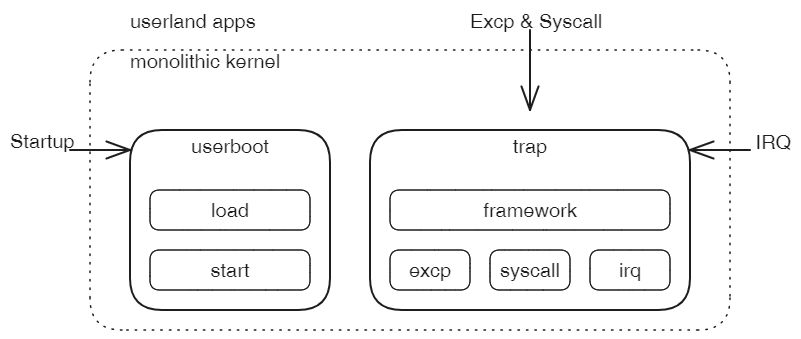

### 第二节 组件仓库

XXX

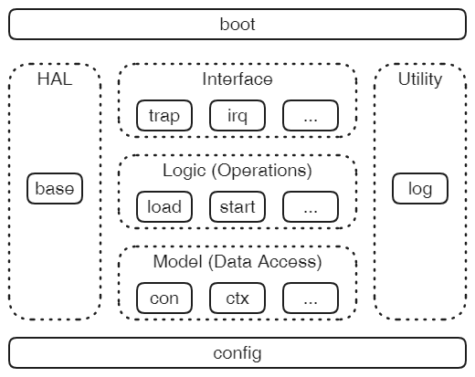

### 第三节 总体实验安排

实验包括六次迭代，每一次迭代都建立在上次迭代的基础上，并且每次迭代成果都是一个宏内核系统：从最简单的雏形到兼容Linux的典型宏内核。如下图，分别标记了每次迭代的**增量**。

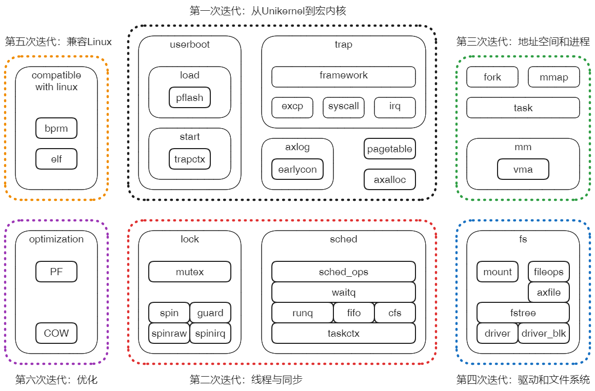

### 第四节 实验框架与工具使用

为简化实验环境和操作步骤，建立了lktool工具和相应的实验框架，如下：

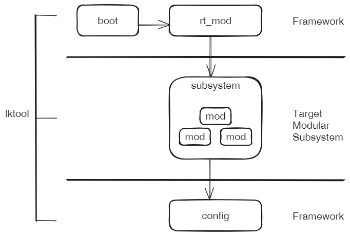

每一步实验的目标都是构建一级组件化的子系统，并对它进行必要的功能和性能验证。这主要通过框架和工具配合完成。

框架分为上下两个部分，上半部包括boot组件和rt_mod运行时组件，前者负责内核的最初引导，后者为目标子系统准备运行环境并启动，下半部config组件为框架和目标系统提供全局参数和配置的支持。

工具lktool封装了配置、准备资源、编译和运行等构建步骤，简化实验过程。

基于上述框架和工具，本实验将从最基础的组件子系统开始，逐级构建更复杂的系统，直至宏内核。

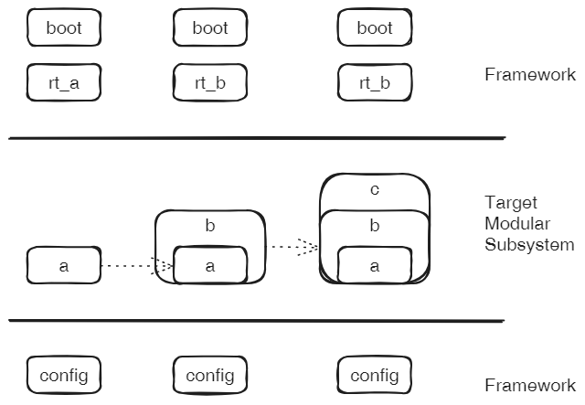

**实验准备**：

1. 下载项目工程和切换分支

   ```sh
   git clone git@github.com:shilei-massclouds/lkmodel.git
   git checkout tour
   ```

2. 编译lktool工具

   ```sh
   cd tools/lktool
   cargo build
   cd ../..
   ```

3. 把lktool加入到环境变量，并采取短名称lk

   ```sh
   export PATH=$PATH:/home/cloud/gitWork/lkmodel/tools/lktool/target/debug
   alias lk='lktool'
   ```

   > 注意：需要把/home/cloud/gitWork/lktool替换为实际路径

**实验步骤**：

本实验指导中所有的实验，基本都遵循如下步骤：

```sh
lk config riscv64
lk chroot rt_xxx
lk prepare
lk run
```

第1行：设置当前体系结构，默认就是riscv64。通常来说，保持默认即可； 如果中间实验过基于x86_64进行了实验，我们只需要执行一次切换回来。

第2行：每一次实验都是在构建一个可以独立运行的内核系统，rt_xxx是该系统的顶级组件。我们会在每个实验中明确指出具体名称。

第3行：部分实验需要一些前置条件，比如可能需要构建一个磁盘系统或提供具体的文件系统作为数据源。这些通过prepare自动建立，所以建议每个实验中都默认执行这一步。

第4行：正式运行实验，并观察结果。


### 第五节 实验0.1 - 系统引导

从计算机启动到内核启动通常要经历下面两个阶段：

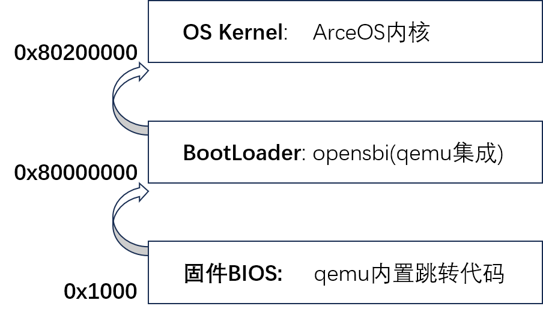

模拟器qemu-riscv64启动时，将会经历几个阶段：

1. 程序寄存器**PC**首先被初始化为0x1000的地址；

2. 地址0x1000处被qemu预先放置了一个ROM，顺序执行其中包含的寥寥几行代码，**PC**跳转到0x8000_0000地址；

3. 地址0x8000_0000同样被qemu预先埋伏了OpenSBI(后文简称SBI)，并且入口就在这个开始地址。SBI由此处启动，进行一系列的硬件初始化工作，并提供一组基本的功能调用，为后面操作系统内核的启动准备好条件和环境；最后一步，SBI从M-Mode切换到S-Mode，并跳转到地址0x8020_0000继续执行。
4. 地址0x8020_0000就是为内核准备的位置，只要我们把内核加载到此处，并且保证内核入口在开头，就能够获得计算机的控制权。

> Riscv体系结构及平台在很多方面都体现了设计上的简洁。RISC-V SBI规范定义了平台固件应当具备的功能和服务接口，多数情况下SBI本身就可以代替传统上固件BIOS/UEFI + BootLoader的位置和作用，qemu-riscv64模拟器同样参照模拟了这一情况，并且把OpenSBI集成到qemu工程内部。而对于X86等体系结构，qemu仍是延用传统方式，即从内嵌seabios开始引导，经过grub等BootLoader的进一步准备，最后再启动操作系统内核。

总结一下，我们的目标是，让自己开发的内核等候在正确的位置上，并以正确的形式存在。具体来说满足以下要求：

1. 内核被加载到0x8020_0000地址

   这是qemu的职责，我们只需要指定正确的参数。

2. 内核编译后的形式必须是binary

   Rust编译器输出的默认执行程序格式是ELF，这种格式需要被ELF加载器解析和加载。

   显然，内核的上一级加载器SBI并不支持ELF功能，所以只能让编译出来的内核以原始binary形式提供。

   > 至少目前OpenSBI还没有支持ELF的计划。但是确实存在一些其它的BootLoader支持这样的功能。

3. 内核入口必须在Image文件的开头

   Rust编译器默认情况下，会自己安排可执行程序文件的分段与符号布局。由于我们必须确保内核入口在最前面，所以需要通过自定义LDS文件方式，控制内核image文件的布局。后面实验将会用到下面的LDS文件linker.lds：

   ```shell
   OUTPUT_ARCH(riscv)
   
   BASE_ADDRESS = 0x80200000;
   
   ENTRY(_start)
   SECTIONS
   {
       . = BASE_ADDRESS;
       _skernel = .;
   
       .text : ALIGN(4K) {
           _stext = .;
           *(.text.boot)
           *(.text .text.*)
           . = ALIGN(4K);
           _etext = .;
       }
       
       ...
   }
   ```

   有两个地方需要注意：

   首先是把代码区.text作为第一个section，并且其中\*(.text.boot)在\*(.text .text.\*)之前，后者是代码默认情况下所属的section属性。将来我们把内核入口的代码标记在.text.boot区域中，就可以确保它会被最早执行。

   此外，起始地址BASE_ADDRESS是0x8020_0000，正是内核的运行地址，这样就可以把内核的链接地址和运行地址一致起来。如果它们不一致，基于绝对寻址方式的指令将无法正常运行，进而导致内核崩溃。将来我们当我们启用分页机制之后，会把这个地址固定改成对应的虚拟地址0xffff_ffc0_8020_0000。直观看来，这个虚拟地址相对物理地址存在一个偏移量0xffff_ffc0_0000_0000，这个偏移的名字是**PHYS_VIRT_OFFSET**，将来它会在虚实地址转换中发挥重要作用，后面第二章第一节会介绍这个偏移量是如何得出的。

   > 注：如果此时就把BASE_ADDRESS设置为0xffff_ffc0_8020_0000或者其它的什么值，似乎程序最初也可以正常运行一部分代码。主要原因是，内核启动早期的那些汇编指令，通常会被有意保持为相对寻址，即它们是位置无关指令，所以BASE_ADDRESS对它们不起作用。但是相对寻址的地址范围受到限制，我们不能要求内核完全采用这种寻址方式，通常只是要求在启用分页之前的指令必须是相对寻址方式。

   LDS中还有一些其它的关键信息，在后边章节再详细介绍。


在内核获得控制权后，进行如下步骤的引导和初始化：

各种操作系统内核在最初启动时，通常都需要完成以下的几项工作：

1. **清零BSS区域**
2. 保存一些必要的信息
3. 启用内存分页
4. 设置中断/异常向量表
5. **建立栈以支持函数调用**
6. ... ...

每一项初始工作都具有特定的作用，并且与后续的工作相关。

这一节作为起步阶段，首先完成**第1步和第5步**，其它工作项暂时忽略，我们将在扩展对应的内核功能时，再回头进行补充。

**第1步** - 清零BSS区域

BSS是构成内核Image的一个特殊的数据区，编译器会把程序中未显式初始化的全局变量放到这个区域，这些全局变量默认值都应当是零。但是编译器本身并不执行BSS清零工作，这个通常是ELF加载器的工作。对于我们正在开发的内核，既然没有其它程序替我们完成，那就只好自己对BSS区域清零。

**第5步** - 建立栈以支持函数调用

建立栈支持函数调用之后，我们就可以脱离晦涩的汇编语言，进入Rust的编程世界，利用Rust高级语言提供的各种先进特性实现内核功能。作为Unikernel内核，应用与内核都会使用这同一个栈，所以我们直接预分配256K的大栈空间，减少将来因栈溢出而带来的困扰。


我们本节要实验的是“空”框架的启动，即重点在于boot子系统的启动过程，最后只是启动一个最简单的内核系统rt_axconfig，它会检查一下axconfig的一个配置项，然后就进入到无限循环。

先来看引导系统boot，结合前面的原理：

```rust
// arch_boot/arch_boot/src/platform/riscv64_qemu_virt/boot.rs
#[naked]
#[no_mangle]
#[link_section = ".text.boot"]
unsafe extern "C" fn _start() -> ! {
    // PC = 0x8020_0000
    // a0 = hartid
    // a1 = dtb
    core::arch::asm!("
        mv      s0, a0                  // save hartid
        mv      s1, a1                  // save DTB pointer
        la      sp, {boot_stack}
        li      t0, {boot_stack_size}
        add     sp, sp, t0              // setup boot stack

        call    {init_boot_page_table}
        call    {init_mmu}              // setup boot page table and enabel MMU

        li      s2, {phys_virt_offset}  // fix up virtual high address
        add     sp, sp, s2

        mv      a0, s0
        mv      a1, s1
        la      a2, {entry}
        add     a2, a2, s2
        jalr    a2                      // call rust_entry(hartid, dtb)
        j       .",
        phys_virt_offset = const PHYS_VIRT_OFFSET,
        boot_stack_size = const TASK_STACK_SIZE,
        boot_stack = sym BOOT_STACK,
        init_boot_page_table = sym init_boot_page_table,
        init_mmu = sym init_mmu,
        entry = sym super::rust_entry,
        options(noreturn),
    )
}
```

从_start入口开始，上面这段汇编代码分为三个部分：

第8~15行：实现了BSS清零，BSS区域的起止地址是\_sbss和\_ebss，都定义在linker.lds中的.bss段中，符号可以被汇编直接引用。

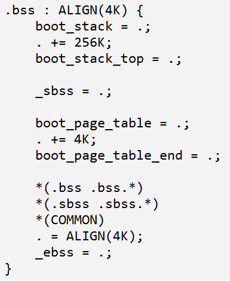

第17行：初始化寄存器sp，指向栈空间的最高地址 - 即栈底位置boot_stack_top，该符号同样是定义在linker.lds文件的.bss中。如上图，在.bss段的开头，预留了256K的空间，并且boot_stack_top是空间的最高地址。另外，需要注意的是，这段栈空间并**不**包含在由\_sbss和\_ebss标记的范围内，因为栈不需要预先初始化。

第25和26行：在栈准备好的情况下，首次进入Rust函数rust_entry。

先通过la指令取得rust_entry的入口地址，然后通过jalr调用该地址。按照RiscV规范，a0到a7寄存器分别作为函数调用的前8个参数，当下只有a0和a1是有效的。这两个寄存器由上一级引导程序SBI设置，a0保存了HartID，也就是当前cpu核的硬件ID；a1则指向了一块内存区，其中保存的是描述底层平台硬件信息的设备树，即dtb。

从上面的那段汇编代码可以看出，内核从启动到调用Rust入口函数过程中，没有使用过a0和a1。如果在这个过程中必须使用它们，就必须先暂存它们的值，然后在调用rust_entry前恢复回来。这个就是本节开始时，提到的**第2项**任务，将来会看到这种处理的必要性。


然后，看看rt_axconfig的实现：

```rust
// axconfig/rt_axconfig/src/main.rs
#![no_std]
#![no_main]

use core::panic::PanicInfo;

#[no_mangle]
pub extern "Rust" fn runtime_main(_cpu_id: usize, _dtb_pa: usize) {
    assert_eq!(axconfig::ARCH, env!("AX_ARCH"));
    panic!("Reach here!");
}

#[panic_handler]
pub fn panic(info: &PanicInfo) -> ! {
    arch_boot::panic(info)
}
```

第8行开始的runtime_main是我们当前实验系统的主要逻辑，检查arch符合后，直接panic。

然后看一下关于arch_boot::panic的实现：

```rust
pub fn panic(_info: &PanicInfo) -> ! {
    loop {}
}
```

很简单，无限循环。下面就来实践一下，这是我们进行的第一个实验。

如上一章的标准实验步骤：

```sh
lk chroot rt_axconfig
lk prepare
lk run
```

显示结果：

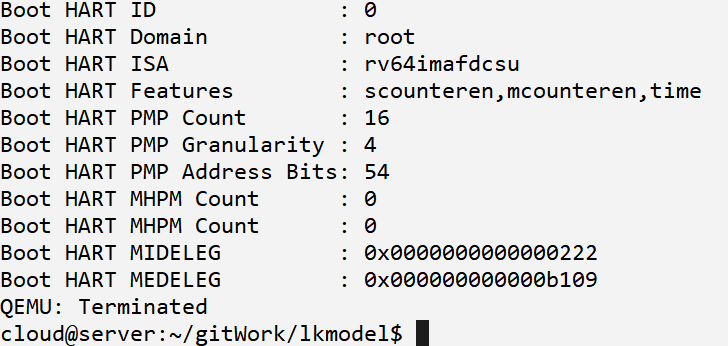

在打印一些OpenSBI的常规输出后，就卡住了。但这是正常的，因为此时我们既没有输出也没有停机。通过ctrl+x+a退出qemu执行。

确认执行正常的方式是查看当前目录下生成的qemu.log，内容如下：

```assembly
IN:
Priv: 1; Virt: 0
0x0000000080200000:  842a              mv              s0,a0
0x0000000080200002:  84ae              mv              s1,a1
0x0000000080200004:  00002117          auipc           sp,8192         # 0x80202004
0x0000000080200008:  ffc10113          addi            sp,sp,-4
0x000000008020000c:  000402b7          lui             t0,262144
0x0000000080200010:  9116              add             sp,sp,t0
0x0000000080200012:  00000097          auipc           ra,0            # 0x80200012
0x0000000080200016:  032080e7          jalr            ra,ra,50

... ...

----------------
IN:
Priv: 1; Virt: 0
0xffffffc0802000ba:  a001              j               0               # 0xffffffc0802000ba
```

第17行：指令"j 0"就是arch_boot::panic中`loop {}`对应的汇编代码，系统在此卡住。

建议大家从日志中0x80200000的那行开始查看，与arch_boot的启动代码进行对照，可以从体系结构层面加深对启动过程的理解。


目前第一个实验的内核系统rt_axconfig还干不了任何有意义的事，它仅是一个“空”的框架。从下章开始，我们将不断的基于这个框架加入新组件和扩展新功能，逐步构建更大规模的内核系统。


## 第一章 - 从Unikernel到宏内核

本章目标：建立最原始的宏内核系统。内核以单线程模式，从pflash加载应用并切换到**用户态**执行。用户态应用运行期间，依次触发异常、发出系统调用，内核能够正常响应和处理。为完成上述功能，内核首先需要支持日志输出、动态内存分配和页表映射功能。

当前阶段宏内核的大部分功能与Unikernel无异，只是在特权级切换与系统调用方面扩展了少量功能。本章进行的一系列实验，展示了从最简单的Unikernel向宏内核演变的过程。

### 第一节 本章系统构成

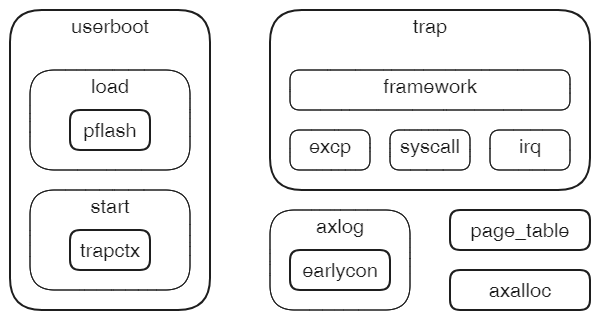

### 第二节 本章实验安排

实验1.1：支持输出信息到屏幕，让内核具备最基础的调试能力。

实验1.2：增加动态内存分配机制，为Rust的alloc库提供内存分配支持，并为内核提供按页分配服务。

实验1.3：重建系统的地址空间，内核支持动态页表映射。

实验1.4：增加PFlash组件，支持从设备直接加载外部应用到指定内存区域。

实验1.5：通过构建异常上下文，让应用返回到用户态运行。

实验1.6：内核支持ebreak异常和自定义系统调用处理，并能够响应时钟中断。

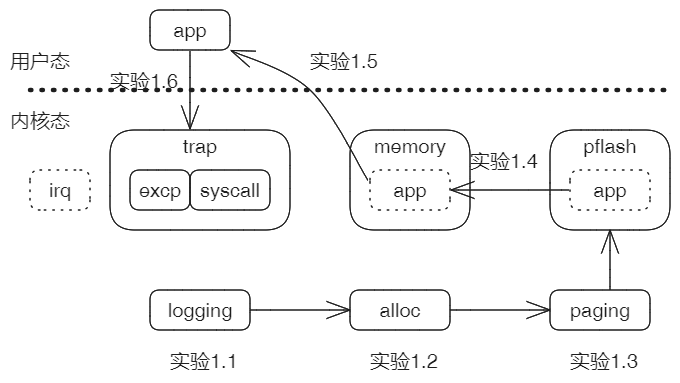

### 第三节 实验1.1 - 控制台输出和系统日志

到目前为止，我们还看不到内核的输出信息，只能通过查看qemu跟踪日志确认工作成果。现在是实现打印输出的时候了！

有两个办法可以让内核支持console，一是通过管理Uart串口设备进行输出，二是直接调用OpenSBI提供的功能。前一个方式需要自己实现驱动，但目前我们连最基础的内存管理都未能完成，缺乏实现驱动的条件；所以决定采用第二个办法。

前面一章提到，OpenSBI提供了一系列功能调用，可以通过调用号去请求SBI为我们完成部分工作。查阅OpenSBI文档，发现功能调用**console_putchar**具有打印输出一个字符的能力，正可以作为输出功能的基础。然后从crates.io中，我们找到了sbi-rt这个现成的库，它封装了对sbi功能调用的各种方法。现在就使用它来实现console模块。

```rust
// early_console/src/console.rs
pub fn putchar(c: u8) {
    #[allow(deprecated)]
    sbi_rt::legacy::console_putchar(c as usize);
}

pub fn write_bytes(bytes: &[u8]) {
    for c in bytes {
        putchar(*c);
    }
}
```

在Cargo.toml中，引入对sbi-rt的依赖

```rust
// early_console/Cargo.toml
[dependencies]
sbi-rt = { version = "0.0.2", features = ["legacy"] }
```

步骤：

```sh
lk chroot rt_tour_1_1
lk run
```

结果：从屏幕输出如下字符串

```sh
[rt_tour_1_1]: ok!
```

证明功能运行成功！


现在我们来为内核正式实现日志组件axlog。在crates.io中已经有一个非常通用的日志crate - log，它主要用于普通应用的开发；本节我们将以它为基础进行封装和扩展，满足内核对日志设施的需要。

首先实现日志的初始化过程和级别设置：

```rust
// axlog/Cargo.toml
[dependencies]
log = "0.4"
crate_interface = "0.1.1"

// axlog/src/lib.rs
#![no_std]

use core::fmt::{self, Write};
use core::str::FromStr;
use crate_interface::call_interface;
use log::{Level, LevelFilter, Log, Metadata, Record};
pub use log::{debug, error, info, trace, warn};

#[crate_interface::def_interface]
pub trait LogIf {
    fn write_str(s: &str);
    fn get_time() -> core::time::Duration;
}

struct Logger;

pub fn init() {
    log::set_logger(&Logger).unwrap();
    log::set_max_level(LevelFilter::Warn);
}

pub fn set_max_level(level: &str) {
    let lf = LevelFilter::from_str(level).ok().unwrap_or(LevelFilter::Off);
    log::set_max_level(lf);
}
```

第4行：Cargo.toml引入log和crate_interface两个crates。

第21行：全局的日志实例Logger，它代表了日志对象，将来对日志的各种操作主要都是针对它。

第23~26行：上一节init()的实现仅是为了测试crate_interface，这里重新实现。先是指定日志对象，然后设置默认日志级别warn。

第28~31行：控制日志级别set_max_level，支持关闭`off`以及 `error`, `warn`, `info`, `debug`, `trace`5个级别。默认是`warn`级，即默认情况下只输出警告与错误。

然后，最重要的一步，按照crate log的实现要求，为Logger实现trait Log接口。这个外部的crate log本身是一个框架，实现了日志的各种通用功能，但是如何对日志进行输出需要基于所在的环境，这个trait Log就是通用功能与环境交互的接口。

下面列出实现Log接口的具体逻辑：

```rust
macro_rules! with_color {
    ($color_code:expr, $($arg:tt)*) => {{
        format_args!("\u{1B}[{}m{}\u{1B}[m", $color_code as u8, format_args!($($arg)*))
    }};
}

#[repr(u8)]
#[allow(dead_code)]
enum ColorCode {
    Red = 31, Green = 32, Yellow = 33, Cyan = 36, White = 37, BrightBlack = 90,
}

impl Log for Logger {
    #[inline]
    fn enabled(&self, _metadata: &Metadata) -> bool {
        true
    }

    fn log(&self, record: &Record) {
        let level = record.level();
        let line = record.line().unwrap_or(0);
        let path = record.target();
        let args_color = match level {
            Level::Error => ColorCode::Red,
            Level::Warn => ColorCode::Yellow,
            Level::Info => ColorCode::Green,
            Level::Debug => ColorCode::Cyan,
            Level::Trace => ColorCode::BrightBlack,
        };
        let now = call_interface!(LogIf::get_time);

        print_fmt(with_color!(
            ColorCode::White,
            "[{:>3}.{:06} {path}:{line}] {args}\n",
            now.as_secs(),
            now.subsec_micros(),
            path = path,
            line = line,
            args = with_color!(args_color, "{}", record.args()),
        ));
    }

    fn flush(&self) {}
}
```

第1~11行：为日志输出功能准备一个宏with_color和颜色代码，后面将根据级别为日志文本增加不同的颜色。

第13~17行：是否启用日志功能，硬编码启用即可。

第19~41行：Log::log方法是关键，准备好显示颜色、当前时间、当前模块路径、行号以及日志内容等一系列参数，然后调用print_fmt执行日志的输出功能。

第43行：flush刷新日志缓存。我们内核日志目前只是打印到屏幕，不涉及刷新，所以忽略。

下一步来看print_fmt的具体实现：

```rust
impl Write for Logger {
    fn write_str(&mut self, s: &str) -> fmt::Result {
        call_interface!(LogIf::write_str, s);
        Ok(())
    }
}

pub fn print_fmt(args: fmt::Arguments) {
    let _ = Logger.write_fmt(args);
}
```

第1~6行：为Logger实现Write trait，目的是借助Rust提供的这个trait，完成从变参到最终字符串的转换。我们只需要实现write_str方法，输入参数已经是处理好的结果字符串，然后通过call_interface调用axhal中实现的LogIf::write_str来完成日志输出。

第8~10行：print_fmt的实现。既然Logger已经实现了Write trait，我们只需要调用Logger的write_fmt方法，Logger就会自动处理变参，进而如上面所述，通过write_str进行输出。

实验步骤：

```sh
lk chroot rt_axlog2
lk run
```

输出：打印出如下日志

```sh
[  0.037260 rt_axlog2:12] [rt_axlog2]: ...
[  0.039436 rt_axlog2:13] [rt_axlog2]: ok!
[  0.039976 axhal::platform::riscv64_qemu_virt::misc:3] Shutting down...
```

当前系统已经具备了基于级别打印日志的功能。

### 第四节 实验1.2 - 动态内存分配

为内核启用动态内存分配功能，主要分两个步骤：

1. 向Rust声明一个支持GlobalAlloc Trait的内存分配器GlobalAllocator，这个Trait是向Rust提供动态内存分配服务的标准接口。
2. 初始化内存分配器，为它指定可以使用的内存地址范围。

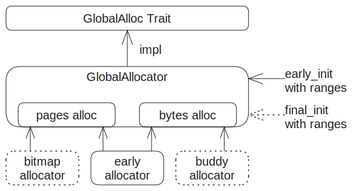

如上图，全局内存分配器GlobalAllocator实现GlobalAlloc Trait，它包含两个功能：字节分配和页分配，分别用于响应对应请求。区分两种请求的策略是，请求分配的大小是页大小的倍数且按页对齐，就视作申请页；否则就是按字节申请分配。这两个内部功能可以由各种内存分配算法支持实现，当前是内核启动早期，我们基于上节提供的early allocator支持两种功能。

全局内存分配器启用时必须指定一组可用的内存地址范围(至少一个)。在内核启动早期，通过early_init方法初始化并启用，这就是本节要实现的主要内容；然后在适当时刻，调用final_init方法切换到正式的内存分配器，


在Rust开发中，String、Vector之类的各种复合类型为我们带来了很大便利。但是我们的内核目前还不支持，因为没有实现动态内存分配器。我们可以来尝试一下，把axorigin的main函数改成这样：

```rust
// axorigin/src/main.rs
#![no_std]
#![no_main]

extern crate alloc;
use alloc::string::String;
use axhal::ax_println;

#[no_mangle]
pub fn main(_hartid: usize, _dtb: usize) {
    let s = String::from("from String");
    ax_println!("\nHello, ArceOS![{}]", s);
}
```

通过`make build`编译一下，报错：

```shell
error: no global memory allocator found but one is required; link to std or add `#[global_allocator]` to a static item that implements the GlobalAlloc trait
```

果然不支持，String需要动态内存即堆管理的支持，普通Rust应用经由std标准库去申请底层操作系统内核对内存分配的支持，但是我们本身就是在实现内核，所以只能自己实现，即 - 我们按照Rust框架要求，实现内核级的动态内存分配器。

内核级内存分配器需要满足两个方面的要求：

* 分配器必须实现GlobalAlloc trait，如String、Vector等集合数据类型都需要基于这个trait定义接口对分配器发出要求，请求以字节为最小分配单位。
* 内核的很多功能都要求申请以**页**为基本单位，并且开始地址按页对齐的分配块。这种按页分配在内核开发中是十分常用和必要的，有必要作为独立的服务接口对外提供。

总结一下，功能上我们需要两种相互独立的内存分配器，一种基于字节分配，另一种基于页分配。

实验步骤：

```sh
lk chroot rt_tour_1_2
lk prepare
lk run
```

预期输出：

在执行axalloc::init()之后，可以使用rust的复合类型String，以及直接提出页分配的请求。如下

```sh
[  0.044782 axalloc:250]   use TLSF allocator.
[  0.045994 axalloc:213] initialize global allocator at: [0xffffffc08026b000, 0xffffffc088000000)
[  0.049591 rt_tour_1_2:19] Alloc string: Hello, axalloc!
[  0.050173 rt_tour_1_2:20] [rt_tour_1_2]: ok!
[  0.050685 axhal::platform::riscv64_qemu_virt::misc:3] Shutting down...
```

### 第五节 实验1.3 - 启用分页

先来建立分页机制的基本数据结构 - 页表和页表项，为后面正式启用分页做准备。

从根页表开始，每一级页表都占用一个内存页，关于内存页大小，我们采用最典型的4096字节。Sv39是针对64位系统的分页方案，即页表项长度是8字节，所以每个页表包含512个页表项。页表作为多级嵌套结构，由页表page_table和页表项page_table_entry两种基本元素交替构成，它们符合如下的模式：


每个页表page_table对应一个内存页，每个页划分为512个页表项page_table_entry；页表项page_table_entry由物理页帧号pfn和标志位组flags这两部分构成。根据标志位不同，页表项有三种情况：

* 空页表项：尚未与物理页建立映射；
* 指向下级页表：pfn保存的是下级页表的物理页帧号，当进行地址映射时，需要递归到下一级页表继续处理；
* 指向最终页：这种是叶子页表项(leaf entry)，它的pfn直接就保存着一个物理页或者**大页**的页帧号。

下面来看一下flags各个位的具体功能定义，这里部分参照了Linux对各个位的命名：

```rust
/*
 * RiscV64 PTE format:
 * | XLEN-1  10 | 9             8 | 7 | 6 | 5 | 4 | 3 | 2 | 1 | 0
 *       PFN      reserved for SW   D   A   G   U   X   W   R   V
 */
const _PAGE_V : usize = 1 << 0;     /* Valid */
const _PAGE_R : usize = 1 << 1;     /* Readable */
const _PAGE_W : usize = 1 << 2;     /* Writable */
const _PAGE_E : usize = 1 << 3;     /* Executable */
const _PAGE_U : usize = 1 << 4;     /* User */
const _PAGE_G : usize = 1 << 5;     /* Global */
const _PAGE_A : usize = 1 << 6;     /* Accessed (set by hardware) */
const _PAGE_D : usize = 1 << 7;     /* Dirty (set by hardware)*/

const PAGE_TABLE: usize = _PAGE_V;
pub const PAGE_KERNEL_RO: usize = _PAGE_V | _PAGE_R | _PAGE_G | _PAGE_A | _PAGE_D;
pub const PAGE_KERNEL_RW: usize = PAGE_KERNEL_RO | _PAGE_W;
pub const PAGE_KERNEL_RX: usize = PAGE_KERNEL_RO | _PAGE_E;
pub const PAGE_KERNEL_RWX: usize = PAGE_KERNEL_RW | _PAGE_E;
```

flags从第10位往上是物理页帧号pfn，而低10位是页表项的属性标志位。

第0位V：页表项是否有效，当访问无效页面时，MMU触发Page Fault之类的异常，这通常作为Linux等内核缺页加载的基本机制；

第1~3位RWE：对映射后的页面是否分别具备读、写、执行权限，当越权访问时，MMU触发Access Fault之类的异常，在Linux等内核实现中，可以基于该类异常实现COW写时拷贝；

第4位U：表示这是用户页。由于实验内核是Unikernel形态，不存在用户态，所以这个位直接清零。

第5位G：表示是全局页。这个位与tlb刷新有关。我们的Unikernel内核中，所有用到的页面都设置为全局页。

第6~7位AD：分别表示Accessed访问过和Dirty被改写过。对于Linux等内核，通常是先把它们清零，如果运行过程中访问或改写了对应映射的页面，MMU硬件会自动把它们置一，内核只要检查这两个位，就能知道是否发生过访问或改写的情况，这通常对页面置换策略有帮助。但是对我们的内核，没有涉及页面置换的问题，所以初始化时，只是简单的把它们都设置成一。

基于上述位，对外提供两个公开的复合标识。PAGE_KERNEL_RW作为默认的地址映射标识，表示映射的页面存在并可以读写；PAGE_KERNEL_RWX在此基础上增加执行权限。

重建内核的地址空间。

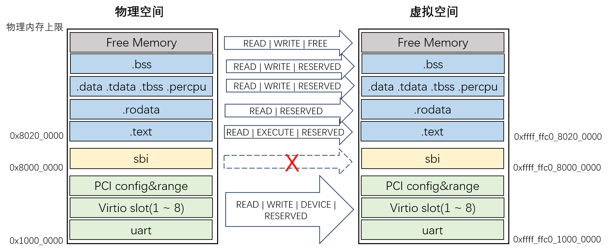

对照第二章第一节建立的虚拟地址空间，重建后的虚拟地址空间有几个主要的变化。

1. SBI被从映射中去除了。SBI相当于上一级的bootloader，我们的内核必须通过SBI提供的sbi_ecall来调用它的功能，不应该看到SBI在地址空间中的映射区间。

2. 内核本身的各个段，按照段的特点属性，进行精细化的映射。例如代码段.text的权限是只读和执行，而数据段.data就是读写。

3. 内核自身空间之上的所有空闲区间，作为内核的堆空间，堆空间的上限是物理内存最高地址，上一章已经通过解析dtb获得。
4. 建立对设备地址区间的映射，主要是virtio-mmio各地址区间，为后面内核进行设备的发现与管理做准备。

其中，上面第1条在重映射过程中忽略SBI占据区间即可；对第2、第3和第4，我们先定义好它们对应的一组地址区间，再进行重映射。

实验步骤：

```sh
lk chroot rt_page_table
lk prepare
lk run
```

预期输出：

在执行page_table::init()之后，可以直接访问virtio-mmio的区域。此时可以禁用page_table的初始化，对比观察效果。

```sh
[  0.062865 rt_page_table:40] Try to access virtio_mmio [0x74726976]
[  0.063595 rt_page_table:43] [rt_page_table]: ok!
[  0.064128 axhal::platform::riscv64_qemu_virt::misc:3] Shutting down...
```

### 第六节 实验1.4 - 从PFlash加载应用

应用的代码和原理，构造二进制程序。

qemu的pflash原理。

从pflash加载应用到用户空间的x01000（预先在实验1.3进行了分配）。实验前后可读。开启SUM。

### 第七节 实验1.5 - 返回用户态执行应用

制造context，返回用户态。

启动前简单设置实验入口。

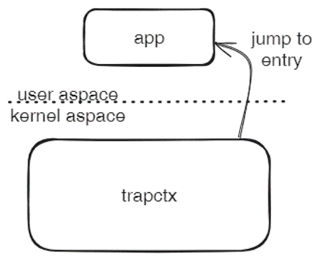

### 第八节 实验1.6 - 响应异常系统调用和中断

初始化异常响应框架。依次响应ebreak异常和write系统调用。

开中断，通过read系统调用获取中断次数。

### 本章总结

XXX


## 第二章 -  线程与同步

本章目标：在上节基础上，内核支持线程级多任务。其中，0号线程负责初始化系统并最后转化为IDLE线程，1号线程负责加载和切换到用户态运行应用。线程间调度策略支持协作式和抢占式；同步机制包括自旋锁与可睡眠的互斥锁。

### 第一节 本章系统构成

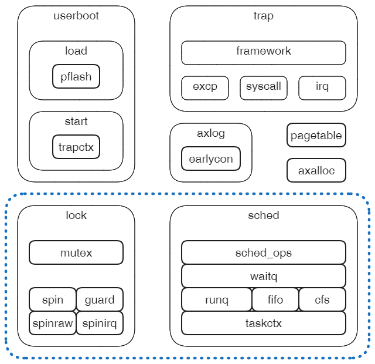

蓝色部分是本章扩展的子系统。

### 第二节 本章实验安排

本章主要内容是线程和同步，后面每一节实验引入一个基本概念与机制，同时相应的增强内核功能，逐步实现内核对多线程（任务）的支持。

实验2.1：支持自旋锁，当前执行流程在形式上封装为初始线程，设置当前任务指针，为支持线程调度作准备。

实验2.2：增加运行任务队列runq，支持创建内核线程，首次实现多线程。

实验2.3：支持创建用户线程，加载和运行应用的工作转移到该线程，初始线程转为Idle。实验线程间协作式调度。

实验2.4：支持抢占式调度。当另外的内核线程过度占用计算资源时，抢占机制可以保证应用线程的正常运行。

实验2.5：支持等待队列和互斥锁。用户线程与内核线程通过上述机制实现同步。

实验2.6：为应用提供睡眠与退出的系统调用。

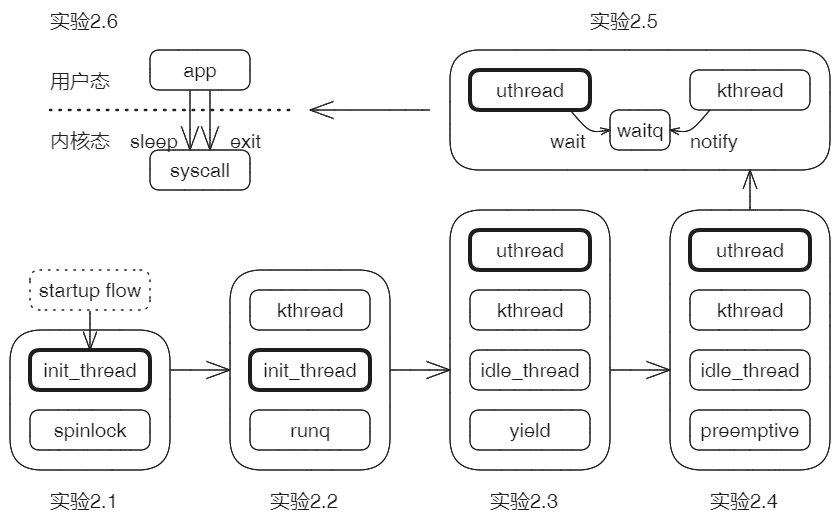

### 第三节 实验2.1 - 自旋锁和初始线程

在我们大部分的实验过程中，宏内核始终在单CPU上运行，这就意味着：目前我们的程序中**不存在并行**，但是即使对于并发环境，仍然需要同步互斥的支持。

1. 当正常执行程序时，会随时被外部的中断而打断运行，然后就会去执行响应中断的例程。中断是随机不可预测的，这样有可能会把原本处于临界区中一组操作打断，破坏它们的原子性、事务性。
2. 后面的实验主要基于时钟中断支持下的抢占式的并发，即任务调度可能随时发生，调度时或许当前任务正好处于临界区中，这样就可能在访问共享资源方面产生冲突。

为了杜绝上述两种可能性，我们需要构建自旋锁。根据上面分析的两点，单核情况下，中断是破坏临界区访问的主要因素，所以我们只要在正常锁操作基础上，关闭中断即可。

定义自旋锁SpinNoIrq和对应的guard变量：

```rust
pub struct SpinNoIrq<T> {
    data: UnsafeCell<T>,
}

pub struct SpinNoIrqGuard<T> {
    irq_state: usize,
    data: *mut T,
}

unsafe impl<T> Sync for SpinNoIrq<T> {}
unsafe impl<T> Send for SpinNoIrq<T> {}

impl<T> SpinNoIrq<T> {
    #[inline(always)]
    pub const fn new(data: T) -> Self {
        Self {
            data: UnsafeCell::new(data),
        }
    }
}
```

加锁时，关中断：

```rust
impl<T> SpinNoIrq<T> {
    #[inline(always)]
    pub fn lock(&self) -> SpinNoIrqGuard<T> {
        let irq_state = NoPreemptIrqSave::acquire();
        SpinNoIrqGuard {
            irq_state,
            data: unsafe { &mut *self.data.get() },
        }
    }
}
```

析构时，恢复中断：

```rust
impl<T> Drop for SpinNoIrqGuard<T> {
    #[inline(always)]
    fn drop(&mut self) {
        NoPreemptIrqSave::release(self.irq_state);
    }
}
```

测试一下自旋锁的功能。测试成功！

### 第四节 实验2.2 - 运行任务队列

在现代操作系统中，多任务支持是基本功能。对我们的内核来说，上层应用可以开启多任务，同时执行多条相对独立的逻辑流程；内核内部同样可以开启多任务，并发完成一些维护性的工作。无论在哪一个层面，合理的多任务调度都可以带来整体效率上的提升。

在多任务方面，任务与调度是两个核心的概念。

**任务(Task)** - 任务是被调度的对象，它具有独立的工作逻辑。任务的核心构成要素包括：

1. 执行流：任务自身的工作逻辑，是一组可执行的指令序列。任务启动时，从任务入口entry开始执行指令流；任务执行过程中，CPU的指令指针寄存器**PC**总是指向本任务执行流的当前指令。
2. 栈：在函数调用机制中，维护任务的当前状态。我们的内核是Unikernel形态，它只有内核态，所以我们也只考虑内核栈kstack。
3. 上下文存储区：上下文是本节的重点，下面专门展开讨论。
4. 状态：有如下四个基本的调度状态。调度过程中，需要随时跟踪和更新任务的状态，作为管理任务的基础。

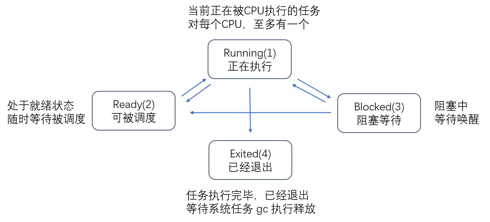


**调度(Sched)** - 调度是当资源不足时，协调每个请求对资源使用的方法。通常，每个任务都在尽力争取获得更多的计算资源 - 其实就是CPU时间，但是CPU无论从数量还是算力常常是处于相对不足的状态的，这就需要协调好有限CPU资源在各个任务之间的分配。协调的好，系统整体效率有保证；协调的不好，系统效率下降甚至卡死。

在ArceOS的语境下，任务等价于线程。也就是说，每个任务拥有**独立的执行流**和**独立的栈**，但是它们没有独立的地址空间，而是共享唯一的内核地址空间。对于调度，我们需要更多的去参考线程调度方面的历史经验。


### 第五节 实验2.3 - 协作式调度

**上下文(Contex或ctx)** - 有些书中也称环境上下文。理解这个概念是理解调度的关键。我们可以把内核系统看作是一个状态机，大多数时间内它在执行任务；某种条件下当前任务会暂停然后切换到另一个任务；触发异常时它会暂停任务转而去处理异常；外部中断同样会打断它的当前工作转而去响应中断。内核状态机会不停的在这几种状态中切换。我们把这几种状态称之为**上下文**，把上述状态的切换称为**上下文切换**。

在特定的体系结构下，上下文的具体表现形式是一组必要的寄存器状态再加上地址空间，上下文切换则基于对寄存器组状态的保存与恢复以及地址空间的切换。但由于我们实验的操作系统是Unikernel模式，只有唯一的地址空间，不存在地址空间切换的问题，所以所谓上下文就仅包含寄存器状态。

在我们的实验内核中，上下文归纳为两类：任务上下文和异常/中断上下文。本章重点讨论的是任务上下文的概念与实现，而对于异常/中断上下文只是简单说明，下一章专门讨论它的具体机制与实现。


上面描述了一大堆概念都比较抽象，下面通过一个示例来说明这些概念：


上图是一个典型任务在整个生命周期过程中，将会(可能会)遇到的几种情况。

1. 任务首次被创建时，状态status默认是Ready，entry为任务执行的入口，创建单独的由kstack指向的栈，还需要预留一块空间作为任务上下文context，用于在任务被调度出去时，保存该任务的运行现场(一组寄存器)，以便在调度回来时恢复现场。
2. 任务被调度运行，状态status变为Running，系统有一个特殊的全局指针CurrentTask指向它，表示它就是当前正在被执行的任务。任务一旦启动之后，entry就不再有用，寄存器pc始终指向CPU当前正在执行的指令，寄存器sp则指向kstack栈的栈顶位置，栈中保持着配合函数调用的栈帧。
3. 任务在运行过程中可能随时被调度出去，使得CPU可以执行其它任务。调度出去的原因有两种：一是它必须等待某种资源可用时，此时任务被设置为Blocked状态，让出执行权；二是它主动（调用yield）或被动（时间片耗尽）让出执行权，状态可能变成Ready。无论何种原因，当前任务的上下文必须首先被保存，即保护现场，等到该任务再次被调度时，把上下文再恢复出来，让任务从上次的断点处继续运行。
4. 任务在运行中，还会遇到另外一种涉及运行环境保存与恢复的情况，即触发异常或遇到外部中断时。此时系统应该挂起当前任务，转而去执行异常/中断的例程，处理完成后再回到任务断点处恢复执行。这期间内核处于一个特殊的运行上下文中，我们称为异常/中断上下文，它会叠加到当前任务的任务上下文之上。具体来说，当前任务的一组寄存器状态会作为TrapFrame被压栈在任务栈之上。关于这部分我们将在下一章重点说明。
5. 任务运行完成后，它的某些资源是无法被自己回收的，所以内核安排了一个内部的系统级任务GcTask，专门负责回收。


ra寄存器是函数返回后要执行的下一条指令地址，对它进行切换的效果：context_switch返回后**竟然**不是返回到原任务执行流，而是返回到另一个执行流中；sp寄存器指向栈，它保持了函数压栈的信息，所以在执行流切换的同时，栈也必须同步切换；s0~s11是按照Riscv规范必须由被调用者负责保存的寄存器，因此一并放到上下文中随任务切换。

简单总结一下，context_switch(...)是一个非常特殊的函数，当前任务在进入函数后，内部**可能**进行任务上下文的切换，等函数返回时，继续执行的**可能**是另一个任务。

实验步骤：

```sh
lk chroot rt_run_queue
lk run
```

预期输出：

构造内核线程级任务，并在runq中成功切换和退出。


### 第六节 实验2.4 - 抢占式调度

抢占是操作系统调度方面的一个基本概念，通常是指，高优先级的任务可以抢占正在运行的低优先级任务的执行权。但是在各种操作系统设计的具体实践上，它们的具体策略、具体设计与实现方式存在差异。这一节，先来澄清ArceOS中，任务抢占采取的具体策略与方式。这个抢占机制有以下几个特点：

1. 抢占是有条件的，并且包括内部条件和外部条件，二者同时具备时，才能触发抢占。内部条件指的是，在任务内部维护的某种状态达到条件，例如本次运行的时间片配额耗尽；外部条件指的是，内核可以在某些阶段，暂时关闭抢占，比如，下步我们的自旋锁就需要在加锁期间关闭抢占，以保证锁范围的原子性。由此可见，这个抢占是兼顾了任务自身状况的，一个正在运行的任务即使是低优先级，在达到内部条件之前，也不会被其它任务抢占。这与典型的硬实时操作系统的抢占就有着明显的区别。
2. 抢占是边沿触发。在内部条件符合的前提下，外部状态从禁止抢占到启用抢占的那个变迁点，会触发一次抢占式重调度resched。


内部条件涉及任务结构的升级和具体策略，这里我们采取一个最简单的调度策略 - Round-Robin：为每个任务分配相同数量的时间片配额，当前任务耗尽本次配额后可以被抢占，它被追加到运行队列的末尾，以此类推，形成一个环形的调度序列，每个任务都能获得近似相等的计算资源。


实验步骤：(待补充)

```sh
lk chroot test_preempt
lk run
```

预期输出：

在禁止抢占情况下保持当前任务运行，在开抢占的时机点触发抢占。


### 第七节 实验2.5 - 等待与唤醒

关于任务退出与等待其它任务退出的问题，这个问题的复杂性在于：任务有两个角色，一方面任务一定会在某个时刻退出，另一方面某个任务可能在运行中阻塞等待另一个任务的退出。关系如下：


至于任务之间是如何形成这样一种相互等待关系的？回顾上一节开头的流程图，MainTask对AppTask调用join，建立等待关系，然后把自己状态设置为Blocked，从运行队列run_queue转移到等待队列wait_queue，然后触发重新调度让出执行权。直到AppTask退出时，MainTask作为等待者被重新唤醒，继续执行。

实验步骤：(待补充)

```sh
lk chroot rt_wait_queue
lk run
```

预期输出：

任务进入等待并让出执行权，随后该等待中的任务被唤醒。


### 第八节 实验2.6 - 应用睡眠与退出

实验预期输出：

```sh
[  0.032055 rt_mutex:20] [rt_mutex]: ...
[  0.034355 axalloc:213] initialize global allocator at: [0xffffffc080273000, 0xffffffc088000000)
[  0.038137 task:287] Initialize schedule system ...
[  0.039305 task:236] CurrentTask::init_current...
[  0.040092 rt_mutex:37] 0
[  0.040629 rt_mutex:40] [rt_mutex]: ok!
```


### 本章总结

XXX


## 第三章 - 驱动和文件系统

本章目标：首先支持块设备和文件系统的初始化，为内核提供文件访问服务；然后在上一章的基础上，把获取应用介质的方式从读PFlash转为访问文件系统。

### 第一节 本章系统构成

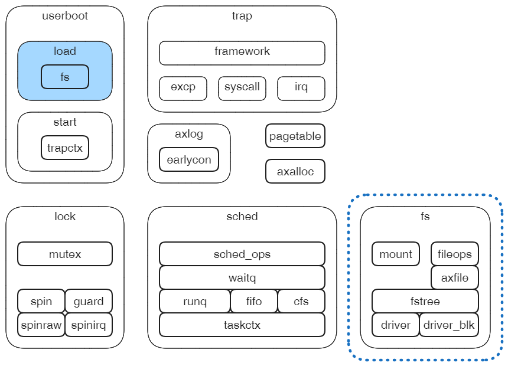

### 第二节 本章实验安排

实验3.1：支持基于内存的块设备，对数据块进行读写实验。

实验3.2：支持基于virtio_blk的块设备，从外部加载磁盘，对数据块进行读写实验。

实验3.3：支持fat32文件系统，从virtio_blk块设备mount文件系统，加载外部应用。

实验3.4：在实验2.6基础上，替换PFlash方式，从fat32文件系统加载外部应用并启动。

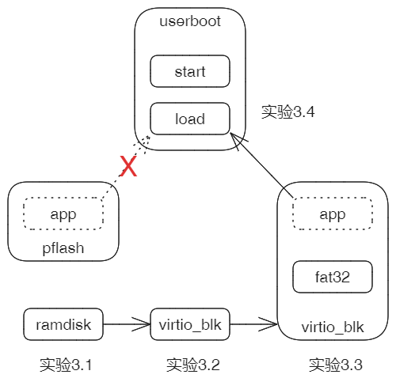

### 第三节 实验3.1 - 基于内存的块设备驱动

实验步骤：

```sh
lk chroot rt_ramdisk
lk run
```

预期输出：

成功读写内存块。


### 第四节 实验3.2 - VirtioBlk块设备驱动

实验步骤：

```sh
lk chroot rt_driver_virtio
lk run
```

预期输出：

成功读写块。

### 第五节 实验3.3 - 文件系统展开

立体展开文件系统，形成由目录和文件构成的树。

对于有后备的文件系统，解析并展开存储在块设备中的扁平的序列化的文件系统数据；

对于伪文件系统，直接建立立体化的目录文件树。

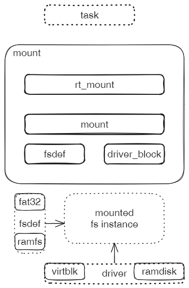

实验步骤：

```sh
lk chroot rt_axmount
lk prepare
lk run
```

预期输出：

挂载fat32文件系统并作为根文件系统，通过查找、读、写确认可操作性。


### 第六节 实验3.4 - 从文件系统加载应用

替换pflash方式。

### 本章总结

XXX


## 第四章 - 地址空间和进程

本章目标：在上一章基础上，内核支持多地址空间，支持进程级任务。原有的0号和1号线程职责不变，但对应升级为进程，其中1号进程拥有独立的地址空间。支持mmap和fork两个进程级别的高级操作。

### 第一节 本章系统构成

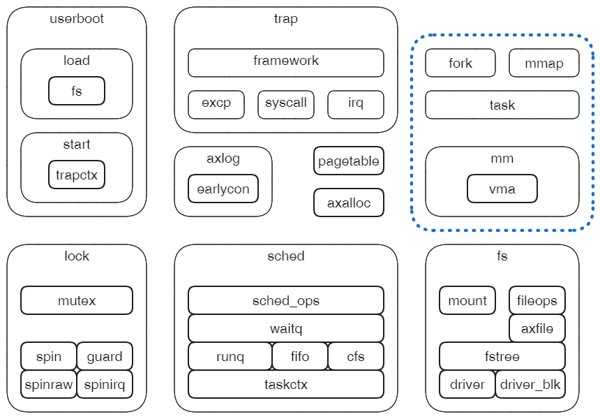

### 第二节 本章实验安排

本章各节主要针对第二章实验，从基于线程的操作升级到进程操作。

实验4.1：支持为每个线程设置独立的页表，升级为进程。实验各进程操作页表不冲突。

实验4.2：支持通过复制当前进程的方式创建新进程，替换第二章实验中的线程创建方式。

实验4.3：支持进程地址空间的映射。替换第二章中对页表的直接操作。

实验4.4：支持文件描述符表，实验进程对所属文件的管理和操作。


### 第三节 实验4.1 - 多页表

XXX

### 第四节 实验4.2 - 创建进程级任务

### 

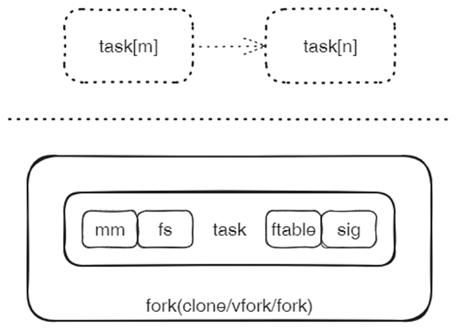

Fork系统以克隆的方式产生新的用户进程，它的上级使用者包括userboot和syscall。

作为leader的fork组件具体完成两步操作：

1. 复制当前task，产生新的task。
2. 把新产生的task投递到runq队列，等待调度。这一步通常称为wakeup。

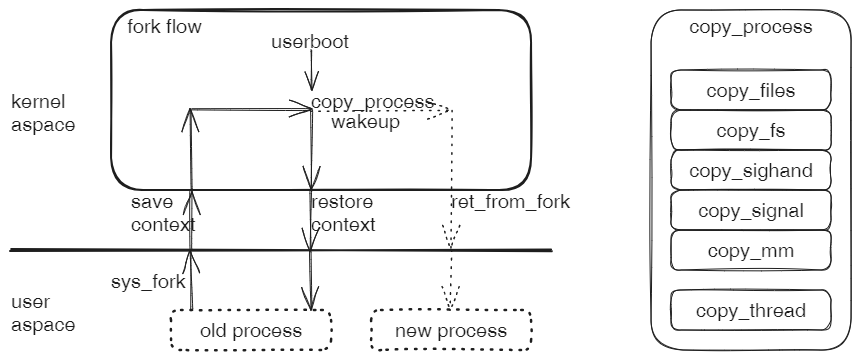

对于syscall发起的请求，fork从发起系统调用的用户进程开始，走一个完整的闭环流程；而对于userboot，只执行后半程。

无论从哪里发起，fork都会执行copy process、wakeup process和ret_from_fork这三步，产生一个新的用户态进程。

1. copy process：根据CloneFlags的要求，新进程对原有进程的各种资源，进行完全复制或者仅共享。其中，copy_thread除了拷贝原进程的寄存器上下文之外，还有可能把一个处理函数插入到流程中，在返回用户态之前调用，这个处理函数由请求者（syscall或userboot）在调用fork时指定。
2. wakeup：把新进程的task投递到runq，等待调度。注：fork流程中不包括调度，因此并不真正启动新进程。
3. ret from fork：从内核态返回到用户态的一系列特殊动作。因为是新产生的进程，与一般返回用户态的动作流程有一定区别。

### 第五节 实验4.3 - 地址空间映射mmap

实验步骤：(待补充)

```sh
lk chroot test_mm_map
lk run
```

预期输出：

在指定的mm地址空间中记录映射区域，并在对应页表中产生映射项。

### 第六节 实验4.4 - 进程级文件操作fileops

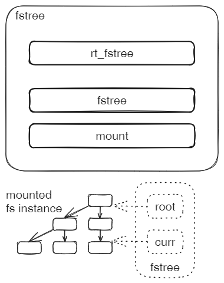

实验操作：

```sh
lk chroot rt_fstree
lk prepare
lk run
```

预期输出：

```sh
[  0.138114 axfs_vfs:256] ============== mount ...
[  0.138519 axmount::fs::fatfs:140] create Dir at fatfs: /sys
[  0.140492 axmount::fs::fatfs:120] lookup at fatfs: /sys
[  0.142422 target:140] Is a directory
[  0.145452 rt_fstree:20] cwd: /
[  0.145889 rt_fstree:22] [rt_fstree]: ok!
```


### 本章总结

XXX


## 第五章 - 兼容Linux

本章目标：直接兼容Linux加载应用的方式，支持原始的Linux应用和glibc库，扩展Linux兼容syscall，支持原始应用的运行。本章将会建立一个典型的、功能相对完整的宏内核系统。

### 第一节 本章系统构成

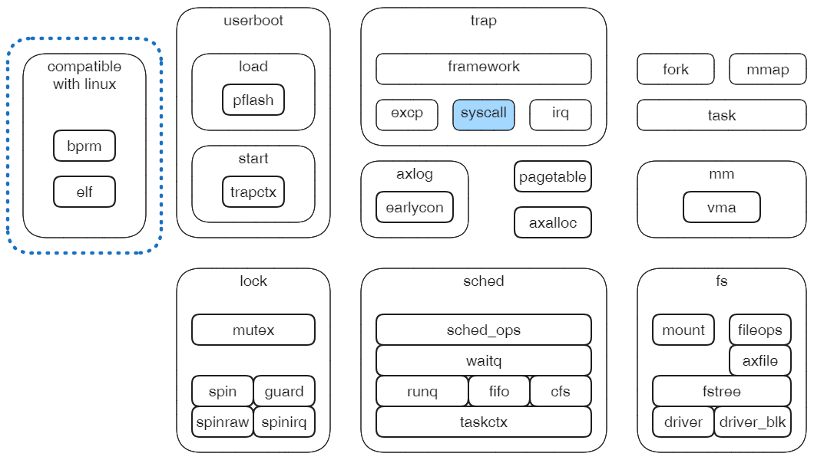

### 第二节 本章实验安排

XXX

### 第三节 实验5.1 - 解析ELF格式文件

XXX

### 第四节 实验5.2 - 准备用户应用地址空间

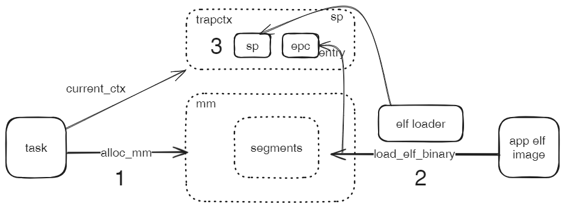

leader组件bprm_loader基于应用程序重置当前进程的地址空间。在四个子系统配合下完成工作。

1. 通过fileops打开和读应用程序。
2. 通过elf解析应用程序文件头信息和各段信息。
3. 通过mmap把标记为LOAD的各段映射到当前进程地址空间的指定位置。
4. 通过userstack构造用户栈，映射到当前进程的地址空间。

### 第五节 实验5.3 - 特权级切换启动应用

XXX

### 第六节 实验5.4 - 支持GLibc和应用的系统调用

XXX

### 本章总结

XXX


## 第六章 - 系统增强与优化

本章目标：在前面的基础上，增加和增强系统功能，优化性能。

### 第一节 本章系统构成

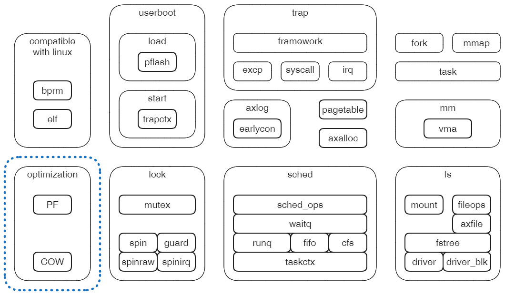

### 第二节 本章实验安排

XXX

### 第三节 实验6.1 - 缺页加载

xxx

### 第四节 实验6.2 - 信号

xxx

### 第五节 实验6.3 - ProcFS

xxx

### 本章总结

XXX


## 附录 - lktool工具

XXX

