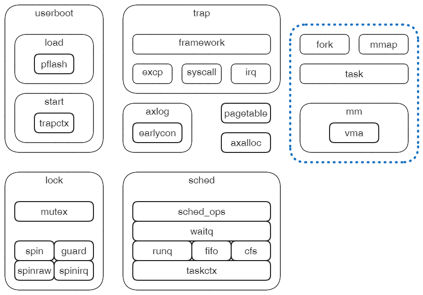
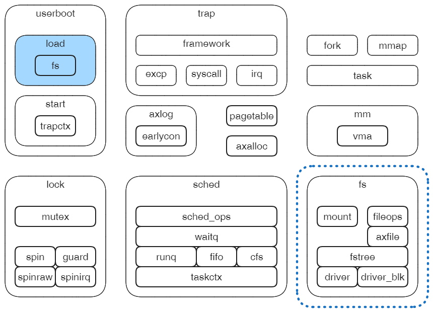

组件化方式建立宏内核的实验指导。

## 第零章 - 实验准备

### 第一节 宏内核系统构成

顶级(一级)子系统和二级子系统

### 第二节 组件仓库和实验框架

XXX

### 第三节 实验环境与工具使用

XXX

### 第四节 实验总体安排

实验包括六次迭代，每一次迭代的成果都是一个宏内核系统，从最简单的雏形到兼容Linux的典型宏内核。

## 第一章 - 从Unikernel到宏内核

## 第二章 -  线程与同步

## 第三章 - 地址空间和进程

## 第四章 - 驱动和文件系统

## 第五章 - 兼容Linux

## 第六章 - 系统优化

## 附录 - lktool工具

